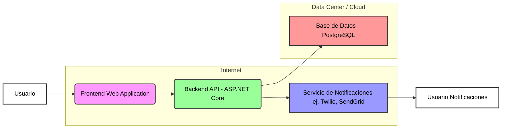

```mermaid
graph LR
    A[Usuario] --> B(Frontend Web Application)
    B --> C(Backend API - ASP.NET Core)
    C --> D[Base de Datos - PostgreSQL]
    C --> E[Servicio de Notificaciones ej. Twilio, SendGrid]
    E --> F[Usuario Notificaciones]

    subgraph Internet
        B
        C
        E
    end

    subgraph Data Center / Cloud
        C
        D
        E
    end

    style A fill:#fff,stroke:#333,stroke-width:2px,color:#000
    style B fill:#f9f,stroke:#333,stroke-width:2px,color:#000
    style C fill:#9f9,stroke:#333,stroke-width:2px,color:#000
    style D fill:#f99,stroke:#333,stroke-width:2px,color:#000
    style E fill:#99f,stroke:#333,stroke-width:2px,color:#000
    style F fill:#fff,stroke:#333,stroke-width:2px,color:#000

```