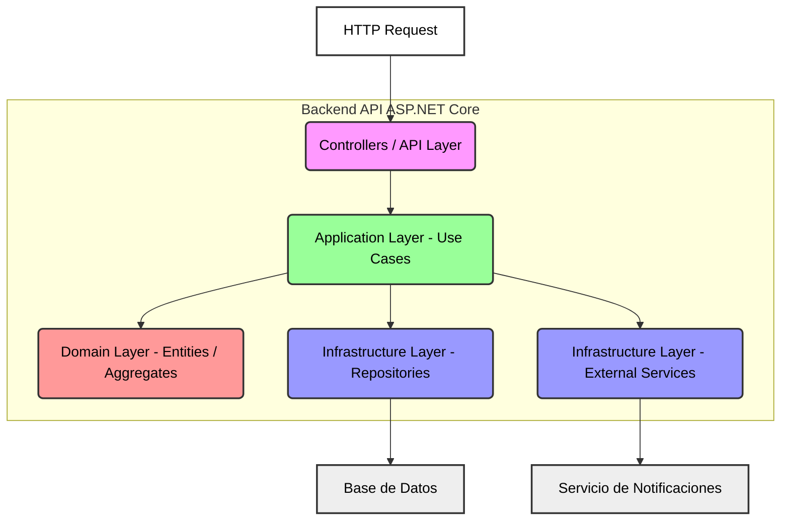

## 3. Componentes del API (C4 – Nivel 3)

### 3.1 Descripción General 
En este nivel de abstracción, desglosamos el contenedor principal de la API REST (tu aplicación ASP.NET Core) en sus **piezas internas clave o módulos principales**. Estos componentes, aunque lógicamente separados, se ejecutan dentro del mismo proceso y se comunican principalmente mediante llamadas a métodos (in-process).
Cada componente:
    - Tiene una **responsabilidad clara** y **específica**.
    - Contribuye a la funcionalidad general del API.
    - Interactúa con otros componentes a través de interfaces bien definidas.

### 3.2 Módulos Principales y Responsabilidades

La siguiente tabla detalla los módulos funcionales dentro de la API, identificando los controladores que exponen sus funcionalidades, los casos de uso (Application Layer) que implementan la lógica de negocio, y las dependencias de infraestructura o servicios externos que consumen.

| Módulo Funcional |Controllers / API Layer | Casos de Uso (Application Layer) | Capa de Infraestructura / Servicios Externos|
|---------------------|-----------------------------|----------------------------------|----------------------------|
| Autenticación      | `AuthController`            | `AuthenticateUser`, `RefreshToken`             | `IAuthService → AuthService`                  |
| Recursos            | `ResourcesController`       | `ListResources`, `GetResource`, `ManageResource` | `IResourceRepository → ResourceRepository`    |
| Reservas            | `ReservationsController`    | `BookResource`, `CancelReservation`, `ListUserReservations` | `IReservationRepository → ReservationRepository` |
| Pagos               | `PaymentsController`        | `ProcessPayment`, `RefundPayment`              | `IPaymentService → StripePaymentService`      |
| Sincronización      | `InventoryController`       | `SyncInventory`, `CheckAvailability`           | `IInventoryService → InventoryExternalService` |
| Salud y métricas    | `HealthController`, `MetricsController` | `RunHealthChecks`, `FetchMetrics` | `IHealthCheckService`, `IMetricsProducerService`|

---

## Diagrama de Componentes del Backend (ResourceReservationApp.Api)

Este diagrama detalla los componentes clave dentro del contenedor del Backend (API de ASP.NET Core) y sus interacciones.

