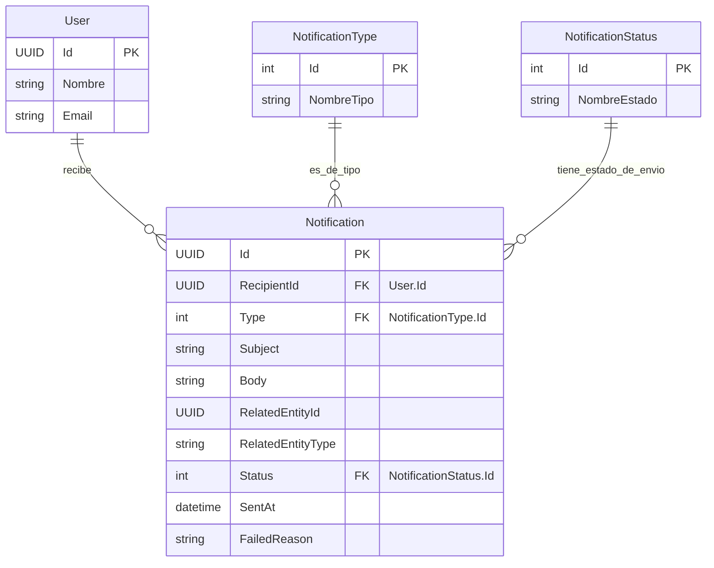

## Entidad de Dominio: `Notification`
>   Archivo: models-domains/Notification.md

Este documento define la entidad de dominio `Notification`, sus propiedades, su propósito dentro del sistema y sus relaciones clave con otras entidades. Sirve como la fuente principal de verdad para el registro y gestión de las comunicaciones automáticas enviadas a los usuarios.

---

### 1. Propósito de la Entidad
La entidad `Notification` representa un registro de cada comunicación generada automáticamente por el sistema para informar a los usuarios sobre eventos importantes, cambios de estado o recordatorios. Su propósito es garantizar que los usuarios reciban información oportuna (ya sea por correo electrónico, SMS o notificación en la aplicación) y mantener un historial auditable de todas las notificaciones enviadas, permitiendo su seguimiento y gestión.

---

### 2. Propiedades y Atributos
A continuación, se detallan las propiedades de la entidad `Notification`, incluyendo su tipo de dato conceptual y una descripción clara de su propósito.

| Propiedades | Tipo de Dato (conceptual) | Descripción |
|-------------|---------------------------|-------------|
|`Id`  | `UUID` (o `int` si es identidad generada por DB) | Identificador único de la notificación. |
|`RecipientId`| `UUID` (o `int`) | IClave foránea (FK) a la entidad User, indicando al usuario que recibe la notificación.|
|`Type` | `Enum` (`int` o `string`) | Tipo de notificación (ej., `Email`, `SMS`, `InApp`, `Push`).|
|`Subject` | `string`| Asunto o título de la notificación (especialmente para correos).|
|`Body` | `string` | Contenido principal del mensaje de la notificación.|
|`RelatedEntityId` | `UUID` (o `int`, `opcional`) |Identificador de la entidad a la que se refiere la notificación (ej., `Reservation.Id`, `Resource.Id`).|
|`RelatedEntityType` |`string` (opcional)|Nombre de la entidad a la que se refiere RelatedEntityId (ej., "Reservation", "Resource"). Útil para polimorfismo.|
|`Status` | `Enum` (`int` o `string`) | Estado de entrega de la notificación (ej., `Pending`, `Sent`, `Failed`, `Read`). |
|`SentAt` | `DateTime` | Marca de tiempo que registra cuándo se intentó enviar la notificación.|
|`FailedReason` | `string` (opcional) | Descripción del error si la notificación falló en el envío.|

---

### 3. Diagrama de Entidad-Relación (ERD)
Este diagrama visualiza la estructura de la entidad Notification y sus relaciones clave con otras entidades en el modelo de dominio.

