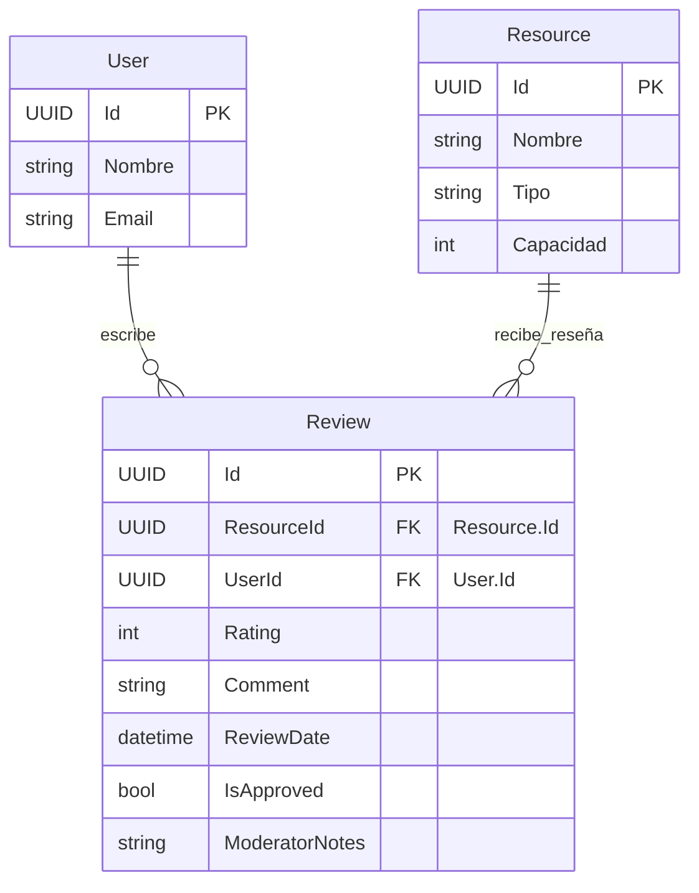

## Entidad de Dominio: `Review`
>   Archivo: models-domains/Review.md

Este documento define la entidad de dominio `Review`, sus propiedades, su propósito dentro del sistema y sus relaciones clave con otras entidades. Sirve como la fuente principal de verdad para el registro de las valoraciones y comentarios que los usuarios realizan sobre los recursos o experiencias de reserva.

---

### 1. Propósito de la Entidad
La entidad `Review` representa la opinión y valoración que un usuario registrado otorga a un recurso (o, potencialmente, a una reserva específica). Su propósito es recoger retroalimentación del cliente para mejorar la calidad de los recursos/servicios ofrecidos, y para ayudar a otros usuarios a tomar decisiones informadas basadas en experiencias previas. Contribuye a la transparencia y la confianza en el sistema.

---

### 2. Propiedades y Atributos
A continuación, se detallan las propiedades de la entidad `Review`, incluyendo su tipo de dato conceptual y una descripción clara de su propósito.

| Propiedades | Tipo de Dato (conceptual) | Descripción |
|-------------|---------------------------|-------------|
|`Id`  | `UUID` (o `int` si es identidad generada por DB) | Identificador único de la reseña. |
|`ResourceId` | `UUID` (o `int`)|Clave foránea (`FK`) a la entidad `Resource`, indicando el recurso que está siendo reseñado.|
|`UserId`|`UUID` (o `int`)|Clave foránea (FK) a la entidad User (Cliente) que realizó la reseña.|
|`Rating` | `int` | Valor numérico de la puntuación (ej., de 1 a 5, donde 5 es la mejor).|
|`Comment` | `string` (opcional) |Comentario o texto detallado de la reseña. Puede ser nulo si solo se da una puntuación.|
|`ReviewDate` | `DateTime` | Marca de tiempo que registra cuándo se creó la reseña.|
|`IsApproved` | `bool` | Indica si la reseña ha sido aprobada por un administrador para ser pública (útil para moderación).|
|`ModeratorNotes`| `string` (opcional) |Notas internas del administrador sobre la moderación de la reseña.|

### 3. Diagrama de Entidad-Relación (ERD)
Este diagrama visualiza la estructura de la entidad `Review` y sus relaciones clave con otras entidades en el modelo de dominio.

