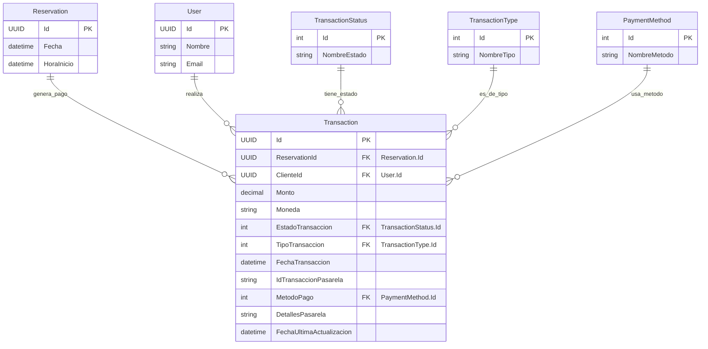

## Entidad de Dominio: `Transaction`
>   Archivo: models-domains/Transaction.md

Este documento define la entidad de dominio `Transaction`, sus propiedades, su propósito dentro del sistema y sus relaciones clave con otras entidades. Sirve como la fuente principal de verdad para el registro de todos los movimientos de pago asociados a las reservas, incluyendo la interacción con pasarelas de pago externas.

---

### 1. Propósito de la Entidad
La entidad `Transaction` representa el registro de un intento o confirmación de pago dentro del sistema. Su propósito principal es rastrear el estado financiero de una reserva, sirviendo como un vínculo crucial con la pasarela de pago externa. Permite auditar los pagos, gestionar reembolsos, y asegurar que cada reserva tenga un historial financiero claro, independientemente del proveedor de pago externo.

| Propiedades | Tipo de Dato (conceptual) | Descripción |
|-------------|---------------------------|-------------|
|`Id`| `UUID` (o `int` si es identidad generada por DB) | Identificador único de la transacción en tu sistema.|
|`ReservationId` | `UUID` (o `int`) | Clave foránea (FK) a la entidad Reservation, indicando la reserva a la que se asocia este pago.|
|`ClienteId` | `UUID` (o `int`) | Clave foránea (FK) a la entidad User (Cliente) que inició la transacción.|
|`Monto` | `Decimal` (`numeric`) |Cantidad total de dinero de la transacción.|
|`Moneda` | `string` (`char(3)`) | Código `ISO 4217` de la moneda utilizada (ej., "MXN", "USD").|
|`EstadoTransaccion` | `Enum` (`int` o `string`) | Estado actual de la transacción (ej., Pendiente, `Completada`, `Fallida`, `Reembolsada`).|
|`TipoTransaccion` | `Enum` (`int` o `string`) | Tipo de operación de la transacción (ej., `Pago`, `Reembolso`, `CargoRecurrente`).|
|`FechaTransaccion` | `DateTime` | Marca de tiempo exacta cuando se inició la transacción en tu sistema.|
|`IdTransaccionPasarela` | `string` (opcional) | Identificador único de la transacción devuelto por la pasarela de pago externa. Crucial para referencias y conciliación.|
|`MetodoPago` | `Enum` (`int` o `string`, opcional)|Método de pago utilizado (ej., `TarjetaCredito`, `PayPal`, `TransferenciaBancaria`).|
|`DetallesPasarela` | `string` (`JSON` o `texto`, opcional) | Información adicional estructurada (JSON) o texto plano recibida de la pasarela de pago (ej., `códigos de error`, `mensajes de confirmación`).|
|`FechaUltimaActualizacion` | `DateTime` | Marca de tiempo de la última actualización del estado de la transacción.|

---

### 2. Propiedades y Atributos
A continuación, se detallan las propiedades de la entidad `Transaction`, incluyendo su tipo de dato conceptual y una descripción clara de su propósito.

---

### 3. Diagrama de Entidad-Relación (ERD)
Este diagrama visualiza la estructura de la entidad Transaction y sus relaciones clave con otras entidades en el modelo de dominio.

