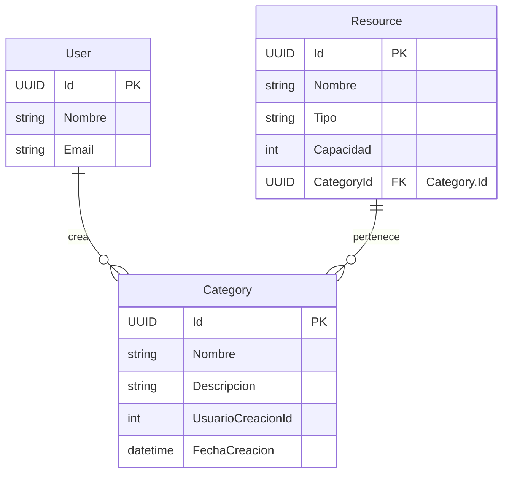

## Entidad de Dominio: `Category`
>   **Archivo:** models-domains/Category.md

Este documento define la entidad de dominio `Category`, sus propiedades, su propósito dentro del sistema y sus relaciones clave con otras entidades. Sirve como la fuente principal de verdad para la estructura de datos relacionada con las categorías a las que los recursos pueden pertenecer.

---

### 1. Propósito de la Entidad
La entidad `Category` tiene como objetivo organizar y clasificar los recursos disponibles en el sistema. Su propósito principal es facilitar la navegación, búsqueda y filtrado de recursos tanto para usuarios como para administradores, asegurando que la información se presente de manera lógica, estructurada y fácil de manejar.

---

### 2. Propiedades y Atributos
A continuación, se detallan las propiedades de la entidad Category, incluyendo su tipo de dato conceptual y una descripción clara de su propósito.

| Propiedades | Tipo de Dato (conceptual) | Descripción |
|-------------|---------------------------|-------------|
|`Id`  | `UUID` (o `int` si es identidad generada por DB) | Identificador único  para cada categoría de recurso.|
|`Name` | `string` | Nombre único y descriptivo de la categoría (ej., "Salas de Reuniones", "Equipos de Proyección").|
|`Description` | `string` | Descripción detallada que explica el tipo de recursos que abarca esta categoría.|
|`CreatedByUserId` | `UUID` (o `int`) | Clave foránea (`FK`) a la entidad `User` (`Usuario`) quien realizó el registro inicial de esta categoría.|
|`CreatedAt` | `DateTime` | Marca de tiempo que registra cuándo se creó la entrada de la categoría.|

---

### 3. Diagrama de Entidad-Relacion (ERD)

Este diagrama visualiza la estructura de la entidad `Category` y sus relaciones clave con otras entidades en el modelo de dominio.

