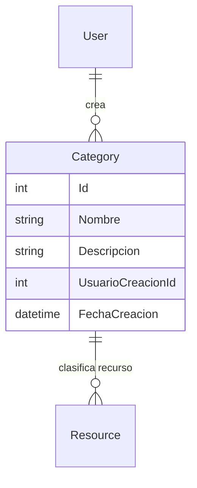

## Entidad Category

Propiedades: 
- `Id` : `int` | Identificador único del tipo de recurso.
- `Nombre` : `string` | Nombre o descripción corta del tipo o categoría a la que pertenece el recurso.
- `Descripcion` : `string` | Descripción de la categoría o tipo al que pertenece el recurso.
- `UsuarioCreacionId` : `int` | Llave foránea para identificar al usuario que creó la ubicación.
- `FechaCreacion` : `DateTime` | Fecha de creación de la ubicación.

## Diagrama
