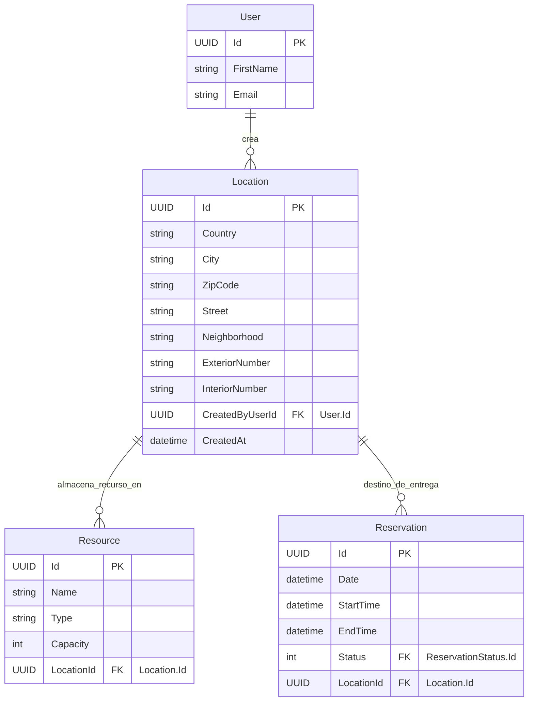

## Entidad de Dominio: `Location`
> **Archivo:** models-domains/Location.md

Este documento define la entidad de dominio `Location`, sus propiedades, su propósito dentro del sistema y sus relaciones clave con otras entidades. Sirve como la fuente principal de verdad para la estructura de datos relacionada con las ubicaciones fisicas.

---
### 1. Propósito de la Entidad
La entidad `Location` representa una ubicación física concreta donde se pueden almacenar o entregar recursos, o donde pueden tener lugar eventos. Es central para la funcionalidad de planificación y gestión, permitiendo registrar la localización precisa de los recursos y el destino de entrega de las reservas.

---
### 2. Propiedades y Atributos
A continuación, se detallan las propiedades de la entidad `Location`, incluyendo su tipo de dato y una descripción clara de su propósito.

| Propiedades | Tipo de Dato (conceptual) | Descripción |
|-------------|---------------------------|-------------|
| `Id`  | `UUID` (o `int` si es identidad generada por DB) | Identificador único de la dirección |
| `Country` | `string` | País donde se entregarán los recursos de la reserva o donde se almacenan los recursos |
| `City` | `string` | Ciudad donde se ubicará el evento o donde se almacenan los recursos|
| `ZipCode` | `string` (o `int` si solo numérico) | CCódigo postal de la ubicación registrada. Considerar string para formatos flexibles (ej. alfanuméricos)|
| `Street` | `string` | Nombre de la calle de la ubicación |
| `Neighborhood` | `string` | NNombre de la colonia, barrio o vecindario de la ubicación.|
| `ExteriorNumber` | `string` | Número exterior de la dirección. Utilizar `string` para manejar caracteres especiales (ej. "S/N", "Lote 3").|
| `InteriorNumber` | `string` (opcional) |Número interior de la dirección, si aplica (puede ser nulo).|
| `CreatedByUserId` | `UUID` (o `int`) | Clave foránea (`FK`) a la entidad `User` (`Usuario`) quien realiza el registro de la direccion.|
| `CreatedAt` | `DateTime`   | Marca de tiempo que registra cuándo se creó la ubicación. |
---

### 3. Diagrama de Entidad-Relación (ERD)
Este diagrama visualiza la estructura de la entidad `Location` y sus relaciones clave con otras entidades en el modelo de dominio.

