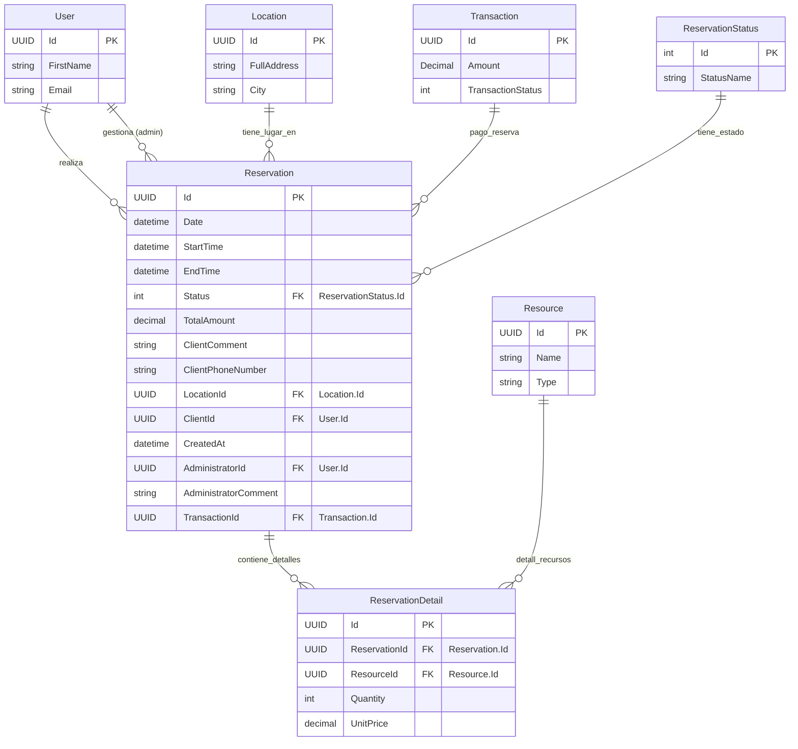

## Entidad de Dominio: `Reservation`
> **Archivo:** models-domains/Reservation.md

Este documento define la entidad de dominio `Reservation`, sus propiedades, su propósito dentro del sistema y sus relaciones clave con otras entidades. Sirve como la fuente principal de verdad para la estructura de datos relacionada con las reservas.

---
### 1. Propósito de la Entidad
La entidad `Reservation` representa la solicitud y confirmación de uso de uno o más recursos por parte de un cliente durante un período de tiempo específico. Es central para la funcionalidad de planificación y gestión de eventos de la aplicación, controlando la disponibilidad de recursos y el historial de uso.

---
### 2. Propiedades y Atributos
A continuación, se detallan las propiedades de la entidad `Reservation`, incluyendo su tipo de dato y una descripción clara de su propósito.

| Propiedades | Tipo de Dato (conceptual) | Descripción |
|-------------|---------------------------|-------------|
| `Id`  | `UUID` (o `int` si es identidad generada por DB) | Identificador único de la reserva |
| `Date` | `Date` | Fecha de la reserva del recurso |
| `StartTime` | `Time` | Hora específica en que el recurso estará disponible para el cliente.|
| `EndTime` | `Time` | Hora específica en que el cliente debe entregar el recurso. |
| `Status` | `Enum` (`int` o `string`) | Estado de la reserva (`pendiente`, `confirmada`, `rechazada`). |
| `TotalAmount` | `Decimal`(`numeric`) | Monto total a pagar por los recursos reservados. |
| `ClientComment` | `string` | Observaciones o indicaciones adicionales proporcionadas por el cliente. |
| `ClientPhoneNumber` | `string` |Número de teléfono del cliente para contacto|
| `LocationId` | `UUID` (o `int`) | Clave foránea (`FK`) a la entidad `Location` (`Direccion`) donde se realizará la reserva.|
| `ClientId` | `UUID` (o `int`)   | Clave foránea (`FK`) a la entidad User (`Cliente`) que realizó la reserva. |
| `CreatedAt` | `DateTime` | Marca de tiempo que registra cuándo se creó la reserva. |
| `AdministratorId` | `UUID` (o `int`, opcional) | Clave foránea (`FK`) a la entidad `User` (`Administrador`) que `confirmó`/`rechazó` la reserva (`puede ser nulo`). |
| `AdministratorComment` | `string` (opcional) | Motivo o nota del administrador al gestionar la reserva, especialmente si es rechazada. |
| `TransactionId` | `UUID` (o `int`, opcional) | Clave foránea (`FK`) a la entidad Transaction (`Pago`) que relaciona el pago de la reserva (puede ser nulo).  |

---
### 3. Diagrama de Entidad-Relación (ERD)
Este diagrama visualiza la estructura de la entidad `Reservation` y sus relaciones clave con otras entidades en el modelo de dominio.

