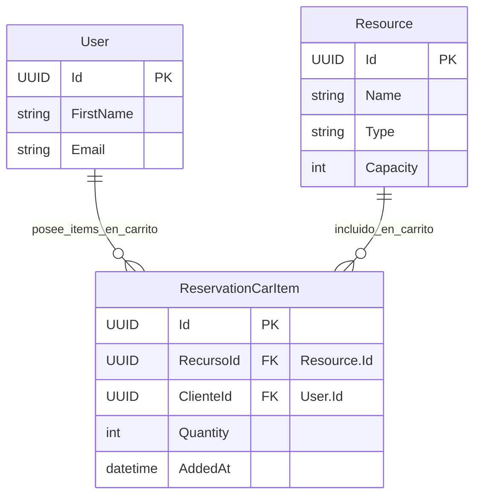

## Entidad de Dominio: `ReservationCarItem`
 >   Archivo: models-domains/ReservationCarItem.md

Este documento define la entidad de dominio `ReservationCarItem`, sus propiedades, su propósito dentro del sistema y sus relaciones clave con otras entidades. Sirve como la fuente principal de verdad para la estructura de datos relacionada con la colección temporal de recursos que un usuario ha seleccionado para una futura reserva.

---
### 1. Propósito de la Entidad
La entidad `ReservationCarItem` representa una colección temporal de recursos que un usuario ha seleccionado con la intención de reservar. Su propósito es centralizar la información necesaria para que, una vez que el cliente esté listo, pueda confirmar fácilmente la reserva de todos los recursos elegidos en un único proceso. Actúa como un área de preparación donde los usuarios pueden agregar, ajustar o eliminar recursos antes de formalizar su reserva.

---
### 2. Propiedades y Atributos
A continuación, se detallan las propiedades de la entidad `ReservationCarItem`, incluyendo su tipo de dato conceptual y una descripción clara de su propósito.

| Propiedades | Tipo de Dato (conceptual) | Descripción |
|-------------|---------------------------|-------------|
|`ClienteId` | `UUID` (o `int`)   | Parte de la Clave Primaria. Clave foránea (FK) a la entidad User (Cliente), identificando al usuario propietario de este ítem del carrito. |
| `ResourceId` | `UUID` (o `int`) | Parte de la Clave Primaria. Clave foránea (FK) a la entidad Resource, identificando el recurso específico que se desea reservar.|
| `Quantity` | `int` | Número de unidades de este recurso específico incluidas en la reserva. |
|`AddedAt`| `DateTime` | Marca de tiempo que registra cuándo se añadió o actualizó por última vez este recurso al carrito del usuario. |

**Nota Importante:** En este diseño, la combinación de ClienteId y ResourceId forma la clave primaria compuesta de esta tabla, asegurando que un mismo cliente no pueda tener el mismo ResourceId duplicado en su carrito. Si el cliente añade el mismo recurso, se actualizará la Cantidad.

---

### 3. Diagrama de Entidad-Relacion (ERD)

Este diagrama visualiza la estructura de la entidad `ReservationCarItem` y sus relaciones clave con otras entidades en el modelo de dominio.

