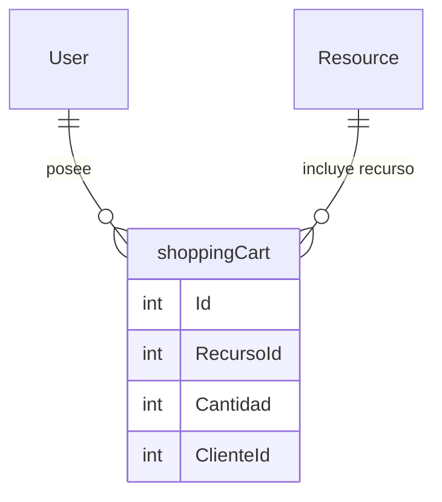

## Entidad ShoppingCart

Propiedades: 
- `Id` : `int` | Identificador único del carrito de compras.
- `RecursoId` : `int` | Llave foránea para saber qué recurso está relacionado con el carrito
- `Cantidad` : `int` | Cantidad de unidades a reservar
- `ClienteId` : `int` | Llave foránea para identificar al usuario al que le pertenece el carrito.

## Diagrama
