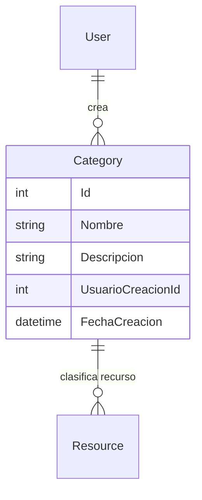

## Entidad Category

 Propiedades: 
 - `Id` : `int` | Identificador unico del tipo de recurso.
 - `Nombre` : `string` | Nombre o descripcion corta del tipo de o categoria a la que pertienece el recurso.
 - `Descripcion` : `string` | Descripcion de la categorio  o tipo al que pertenece el recurso.
 - `UsuarioCreacionId` : `int` | Llave foranea para identificar al usuario al que le pertenece la ubicacion.
 - `FechaCreacion` : `DateTime` | Fecha de crecion de la ubicacion.

## Diagrama
