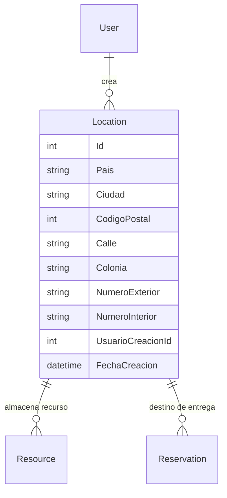

## Entidad Location

Propiedades: 
- `Id` : `int` | Identificador único de la ubicación
- `Pais` : `string` | País donde se entregarán los recursos de la reserva o donde se almacenan los recursos
- `Ciudad` : `string` | Ciudad donde se ubicará el evento o donde se almacenan los recursos
- `CodigoPostal` : `int` | Código postal de la ubicación registrada
- `Calle` : `string` | Nombre de la calle de la ubicación
- `Colonia` : `string` | Nombre de la colonia de la ubicación
- `NumeroExterior` : `string` | Número exterior de la ubicación registrada
- `NumeroInterior` : `string` | Número interior de la ubicación registrada
- `UsuarioCreacionId` : `int` | Llave foránea para identificar al usuario al que le pertenece la ubicación.
- `FechaCreacion` : `DateTime` | Fecha de creación de la ubicación.

