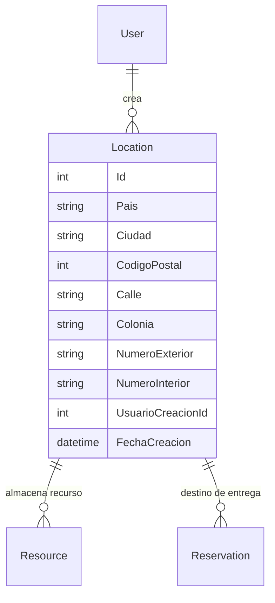

## Entidad location

 Propiedades: 
 - `Id` : `int` | Identificador unico de la ubicacion 
 - `Pais` : `string` | Pais donde se entregaran los recursos de la reserva o donde se almacenan los recursos
 - `Ciudad` : `string` | Ciudad donde se ubicara el evento o o donde se almacenan los recursos
 - `CodigoPostal` : `int` | Codigo postal de la ubicacion registrada
 - `Calle` : `string` | Nombre de la calle de la ubicacion
 - `Colonia` : `string` | Nombre de la colonia de la ubicacion
 - `NumeroExterior` : `string` | Numero exterior de la ubicacion registrada
 - `NumeroInterior` : `string` | Numero interior de la ubicacion registrada
 - `UsuarioCreacionId` : `int` | Llave foranea para identificar al usuario al que le pertenece la ubicacion.
 - `FechaCreacion` : `DateTime` | Fecha de crecion de la ubicacion.

