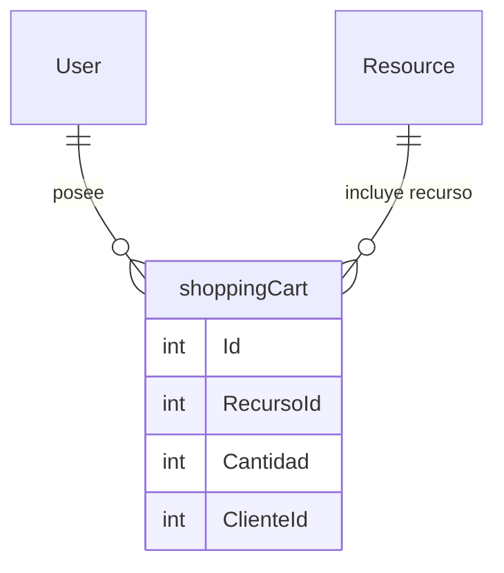

## Entidad shoppingCart

 Propiedades: 
 - `Id` : `int` | Identificador unico del carrito de ccompras.
 - `RecursoId` : `int` | Llave foranea para saber que recurso esta relacionado con el carrito
 - `Cantidad` : `int` | Cantidad de unidades a reservar
 - `ClienteId` : `int` | Llave foranea para identificar al usuario al que le pertenece el carrito.

## Diagrama
