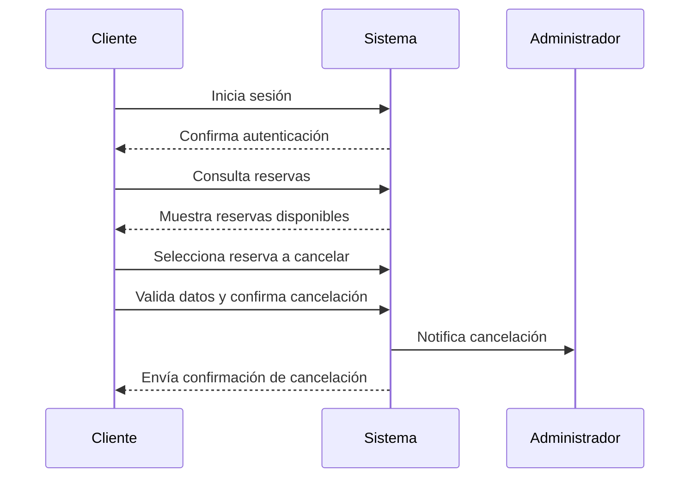

### Caso de Uso: "Realizar una Reserva"

**Actor:** Cliente  
**Flujo Básico:**
1. El cliente inicia sesión.
2. Consulta las reservas realizadas. 
3. Seleciona la reserva a cancelar.
4. valida los datos y confima cancelacion.
5. El sistema notifica al administrador.
6. Se envía una notificación de confirmación cliente.

### Diagramas

