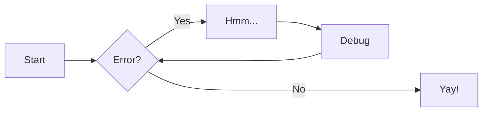
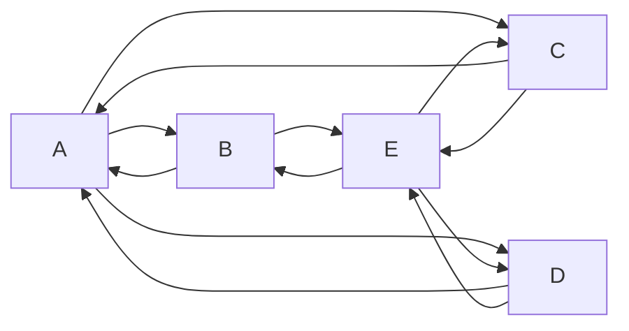

### Caso de Uso: "Realizar una Reserva"

**Actor:** Cliente  
**Flujo Básico:**
1. El cliente inicia sesión.
2. Consulta la disponibilidad de recursos para una fecha determinada.
3. Selecciona uno o varios recursos y añade detalles (número de personas, horario).
4. Envía la solicitud de reserva.
5. El sistema notifica al administrador.
6. El administrador revisa y aprueba o rechaza la reserva.
7. Se envía una notificación de confirmación o rechazo al cliente.

### Diagramas

