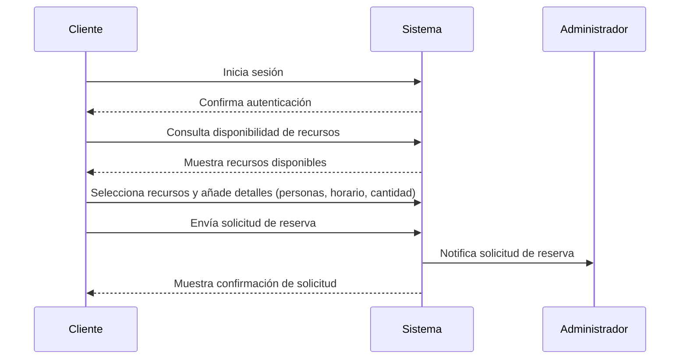
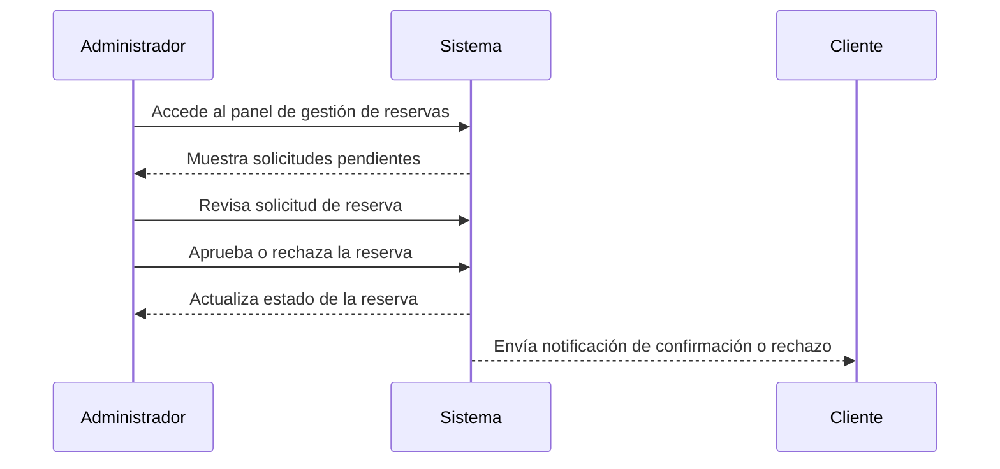
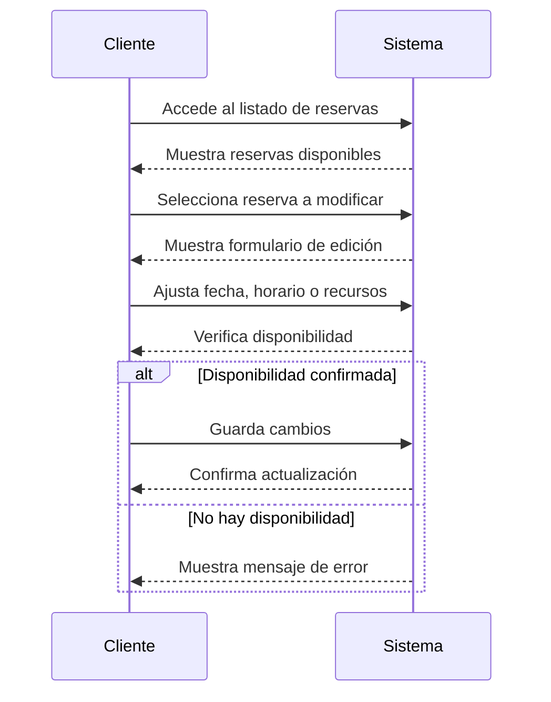
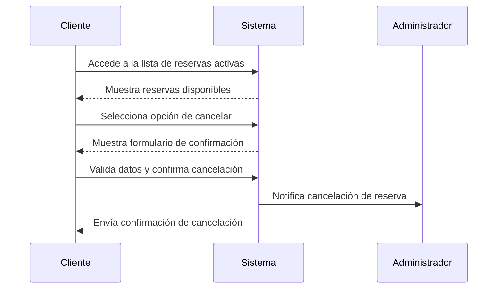
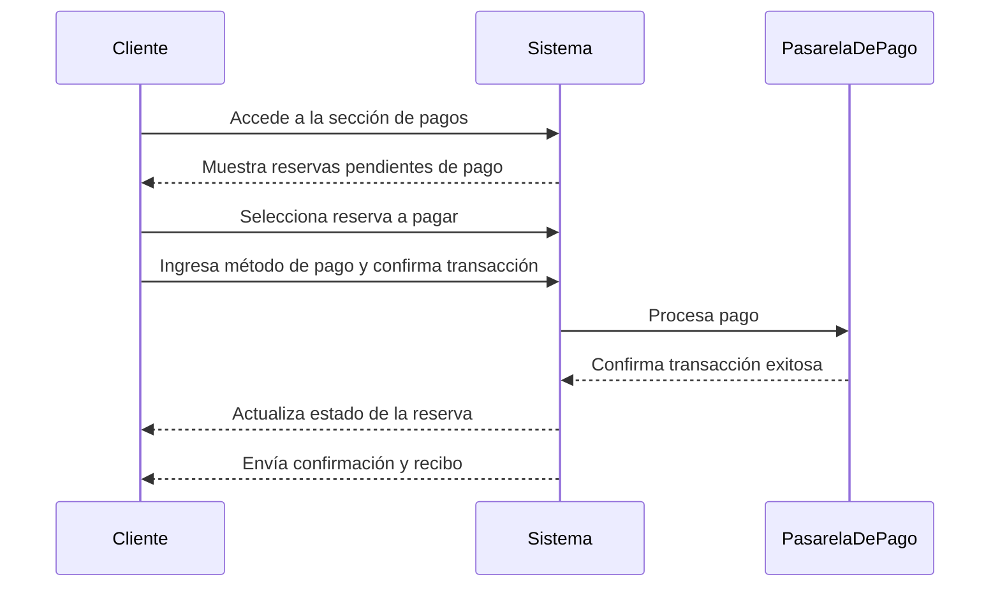
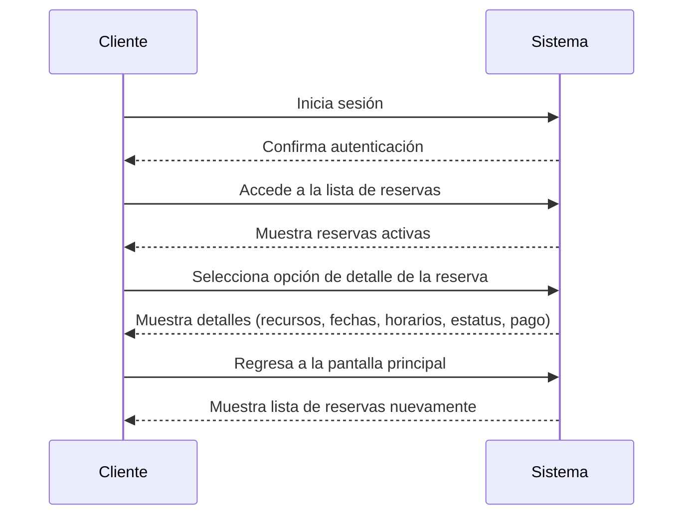

### Caso de Uso: "Gestión de Reservas"

Este documento describe los procesos de gestión de reservas dentro del sistema. Incluye las interacciones del Cliente y el Administrador con el flujo de creación, gestión y pago de reservas.

## Actores
- **Cliente:** Usuario que realiza reservas de recursos disponibles en el sistema.
- **Administrador:** Responsable de gestionar las solicitudes de reserva y controlar la disponibilidad.

---

## Casos de Uso

### **Cliente: Crear una Reserva**
**Flujo básico:**
1. El cliente inicia sesión.
2. Consulta la disponibilidad de recursos para una fecha determinada.
3. Selecciona uno o varios recursos y añade detalles (número de personas, horario, cantidad, etc).
4. Envía la solicitud de reserva.
5. El sistema notifica al administrador.
6. Se muestra una notificación de confimación de solicitud al cliente. 

---
### **Administrador: Gestionar una Reserva (Aprobar/Rechazar)**
**Flujo básico:**
1. El administrador accede al panel de gestión de reservas.
2. Revisa las solicitudes pendientes.
3. El administrador revisa y aprueba o rechaza la reserva.
4. El sistema actualiza el estado y notifica al cliente.
5. Se envía una notificación de confirmación o rechazo al cliente.

---

### **Cliente: Editar una Reserva**
Las ediciones solo se pueden hacer 24 horas antes de la fecha de la reserva y estaran sujetas a disponibilidades de los recursos

**Flujo básico:**
1. El cliente accede a su listado de reservas.
2. Selecciona la reserva a modificar.
3. Ajusta fecha, horario o recursos (se debe apegar a las disponibilidades del momento).
4. Guarda los cambios.
5. El sistema notifica la actualización.

---

### **Cliente: Cancelar una Reserva**
Las cancelaciones solo se pueden hacer 24 horas antes de la fecha de la reserva

**Flujo básico:**
1. El cliente accede a la lista de reservas activas.
2. Selecciona la opción de cancelar.
3. valida los datos y confima cancelacion.
4. El sistema notifica al administrador.
5. Se envía una notificación de confirmación cliente.

---

### **Cliente: Pago de Reserva**
**Flujo básico:**
1. El cliente accede a la sección de pagos.
2. Selecciona la reserva pendiente de pago.
3. Ingresa el método de pago y confirma la transacción.
4. El sistema procesa el pago y actualiza el estado de la reserva.
5. Se envía confirmación y recibo al cliente.

---

### **Cliente: visualizar detalles de la reserva**
**Flujo básico**
1. El cliente inicia sesión.
2. El cliente accede a la lista de reservas
3. Selecciona la opcion de detalle de la reserva.
4. Se muestra una pantalla con los detalles de los recursos, fechas, horarios, estatus, pago.
5. se puede volver a la pantalla principal y selecccionar otra reserva.

