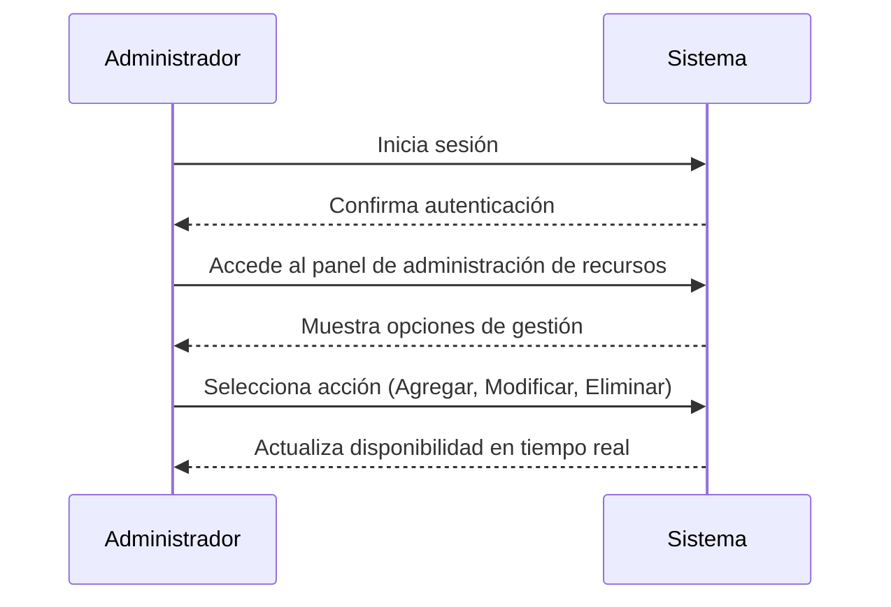
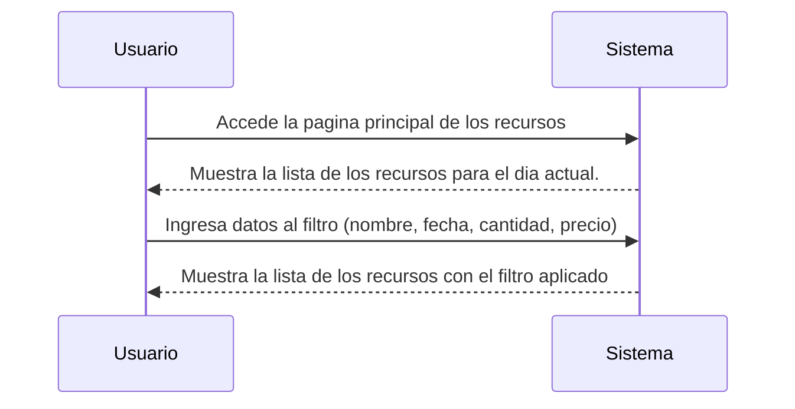
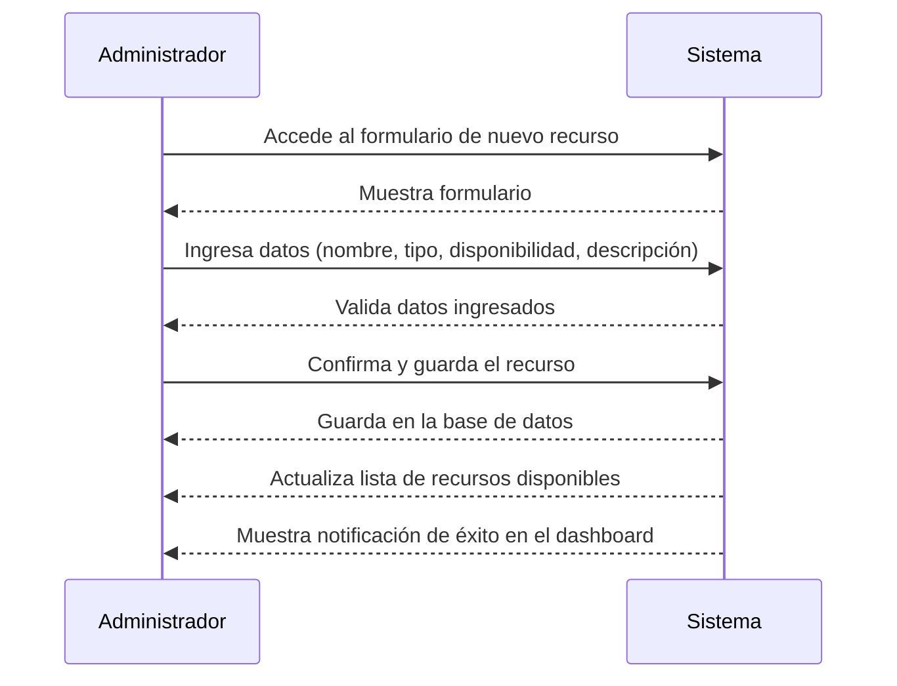
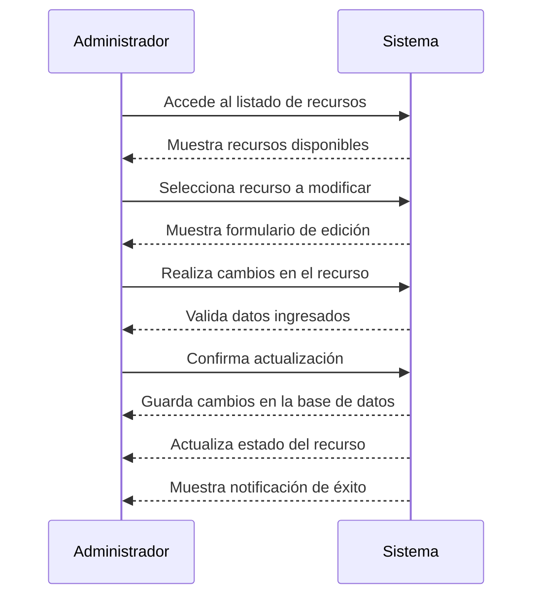
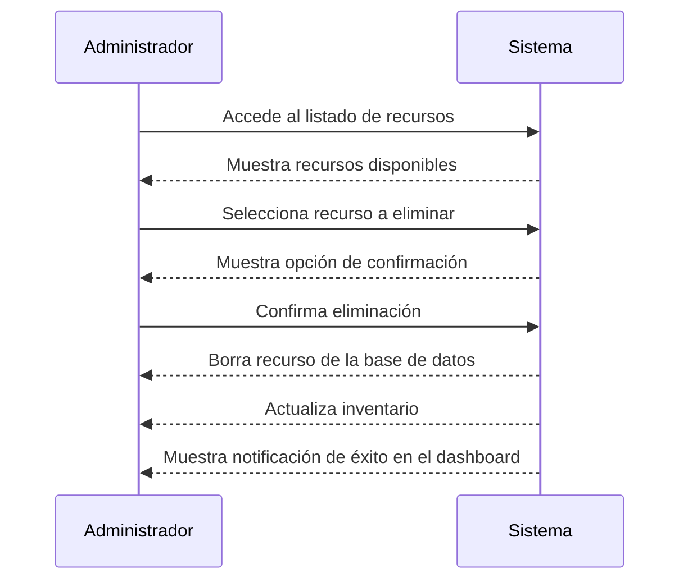

### Gestión de Recursos

**Descripción General**
Este caso de uso describe la capacidad del administrador para gestionar los recursos disponibles en el sistema. Incluye la creación, modificación y eliminación de recursos.

**Actores**
- **Cliente:** Usuario que realiza reservas de recursos disponibles en el sistema.
- **Administrador:** Responsable de gestionar las solicitudes de reserva y controlar la disponibilidad.

---

**Actor:** Administrador  

**Flujo Principal**
1. El administrador inicia sesión en el sistema.
2. Accede al panel de administración de recursos.
3. Puede seleccionar si quiere agregar, modificar o eliminar un recurso.
4. Según la acción seleccionada, sigue el flujo correspondiente.

---

## Consultar Lista de Recursos
Con el fin de facilitar la consulta de recursos para su reservacion, se enlistara un resumen da cada uno en la pagina principal, mostrando la informacion mas importante y permitiendo filtrar la informacion por categoria, precio, cantidad y por fecha. 
Al hacer la consulta del resurso por una fecha en particular, el sistema debe buscar todas las reservas con un estatus confirmado en la tabla de reservation para ese dia y para cada resurso, y sumar todas las cantidades reservadas que existan, esto se aplica para cada recurso por separado.

**Flujo Básico**
1. El usuaroi accede a la pagina  principal para listar los recursos.
2. Flitra los recursos por fecha (nombre, categoria, cantidad, precio).
3. visualisa la salida del filtro.

---

## Agregar un Recurso
Para facilitar el flujo de aprobación de reservas se configurarán los recursos para poder identificar cuándo la autorización de la reserva de dicho recurso es automática o manual (donde el administrador debe autorizar).

**Flujo Básico**
1. El administrador accede al formulario para agregar un nuevo recurso.
2. Ingresa los datos del recurso (nombre, tipo, disponibilidad, descripción).
3. Confirma y guarda el nuevo recurso.
4. El sistema actualiza la lista de recursos disponibles.
5. Se muestra una notificación de éxito en el dashboard.

---

## Modificar un Recurso
**Flujo Básico**
1. El administrador accede al listado de recursos.
2. Selecciona el recurso que desea modificar.
3. Realiza los cambios necesarios en el formulario de edición.
4. Confirma la actualización.
5. El sistema guarda los cambios y actualiza el estado del recurso.

--- 

## Eliminar un Recurso

**Flujo Básico**
1. El administrador accede al listado de recursos.
2. Selecciona el recurso que desea eliminar.
3. Confirma la acción de eliminación.
4. El sistema borra el recurso y lo remueve del inventario.
5. Se muestra una notificación de éxito en el dashboard.

