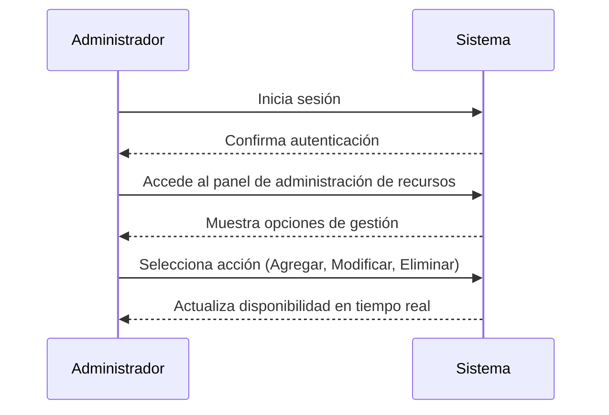
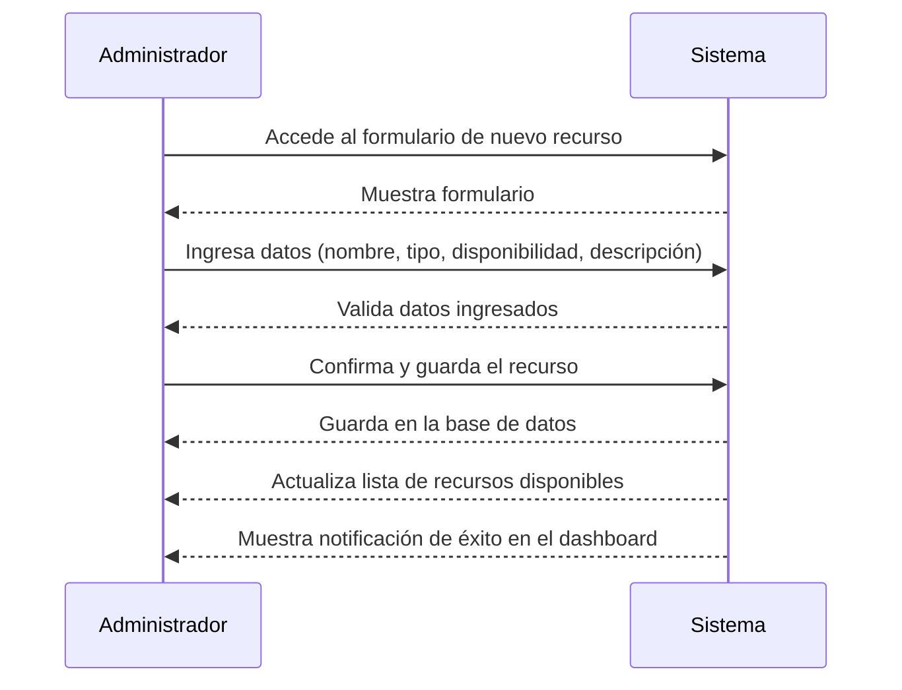
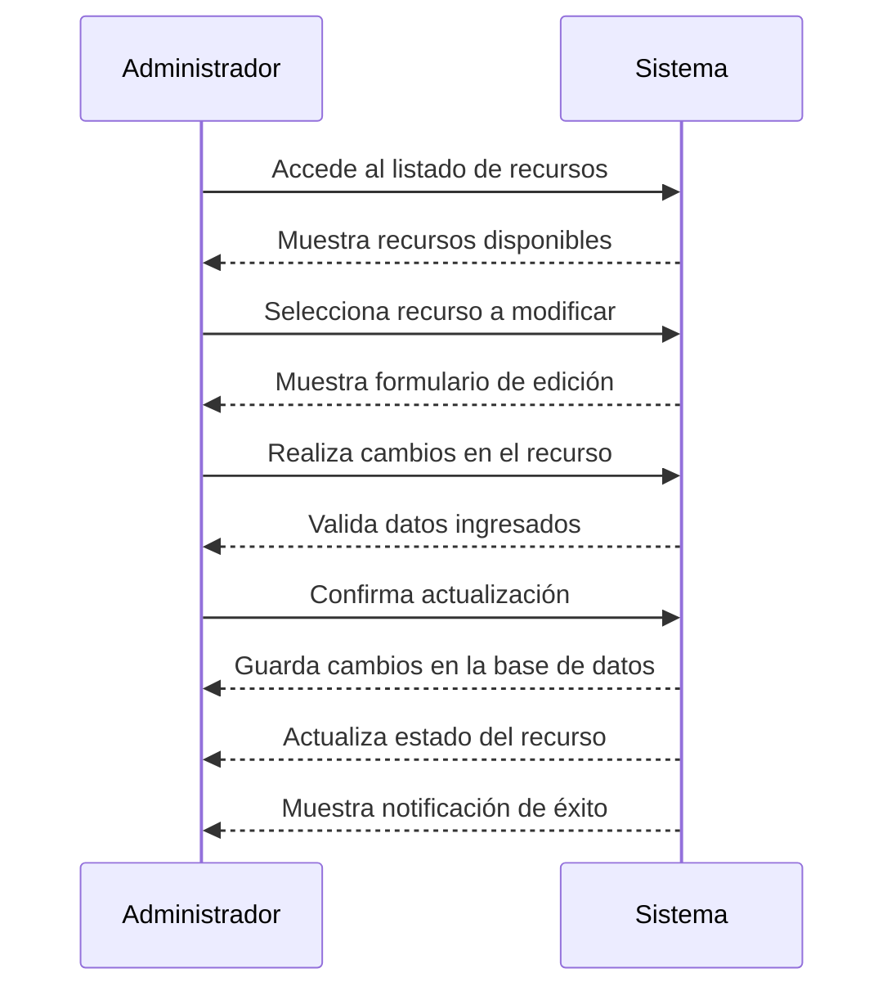
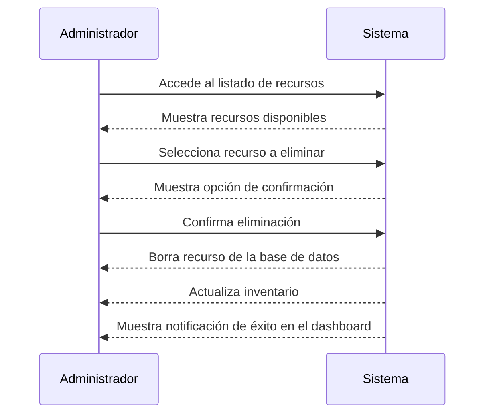

### Caso de Uso: "Gestión de Recursos"

## Descripción General
Este caso de uso describe la capacidad del administrador para gestionar los recursos disponibles en el sistema. Incluye la creación, modificación y eliminación de recursos.

## Actores
- **Cliente:** Usuario que realiza reservas de recursos disponibles en el sistema.
- **Administrador:** Responsable de gestionar las solicitudes de reserva y controlar la disponibilidad.

---

**Actor:** Administrador  

**Flujo Principal**
1. El administrador inicia sesión en el sistema.
2. Accede al panel de administración de recursos.
3. Puede seleccionar si quiere agregar, modificar o eliminar un recurso.
4. Según la acción seleccionada, sigue el flujo correspondiente.

---

## Subcaso de Uso: Agregar un Recurso
**Flujo Básico**
1. El administrador accede al formulario para agregar un nuevo recurso.
2. Ingresa los datos del recurso (nombre, tipo, disponibilidad, descripción).
3. Confirma y guarda el nuevo recurso.
4. El sistema actualiza la lista de recursos disponibles.
5. Se muestra una notificación de éxito en el dashboard.

---

## Subcaso de Uso: Modificar un Recurso
**Flujo Básico**
1. El administrador accede al listado de recursos.
2. Selecciona el recurso que desea modificar.
3. Realiza los cambios necesarios en el formulario de edición.
4. Confirma la actualización.
5. El sistema guarda los cambios y actualiza el estado del recurso.

--- 

## Subcaso de Uso: Eliminar un Recurso

**Flujo Básico**
1. El administrador accede al listado de recursos.
2. Selecciona el recurso que desea eliminar.
3. Confirma la acción de eliminación.
4. El sistema borra el recurso y lo remueve del inventario.
5. Se muestra una notificación de éxito en el dashboard.

