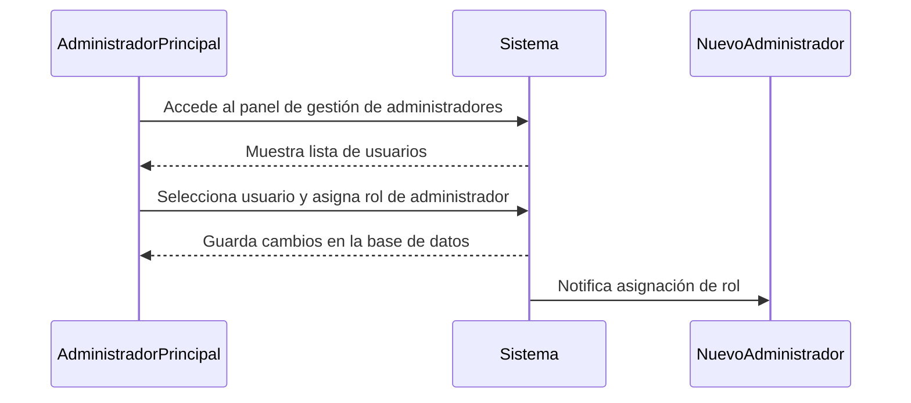
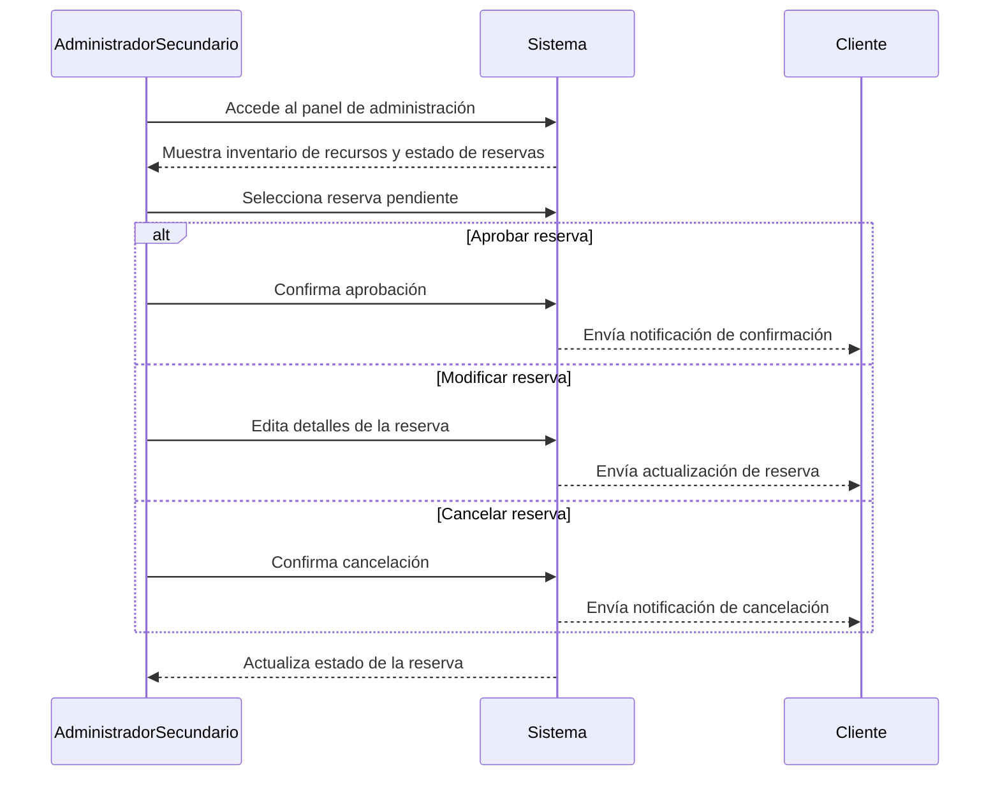
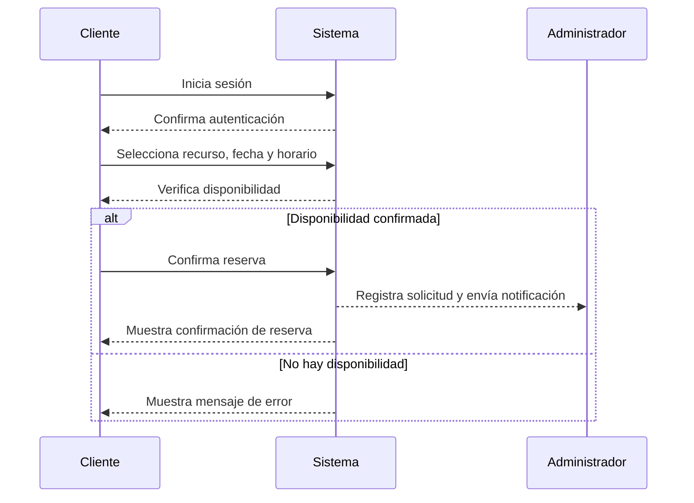

### Caso de Uso: "Gestión de Usuarios"

## Introducción
Este documento describe los roles y permisos de los actores en el sistema, estableciendo el flujo de gestión de usuarios y administradores.

## Actores
1. **Administrador Principal**  
   - Gestiona la administración global del sistema.  
   - Autoriza y asigna permisos a los demás administradores.  
   - Supervisa el estado general del sistema.

2. **Administradores Secundarios**  
   - Gestionan los recursos y reservas dentro del sistema.  
   - Validan, rechazan o aprueban solicitudes de reserva.  
   - Actualizan el inventario de recursos disponibles.  

3. **Clientes**  
   - Realizan reservas y consultas de disponibilidad.  
   - Pueden modificar o cancelar sus reservas.  
   - Procesan el pago de reservas.

---

## **Casos de Uso por Rol**

### **Caso de Uso: "Autorizar Administradores Secundarios"**  
**Actor:** Administrador Principal  
**Flujo Básico:**  
1. El Administrador Principal accede al panel de gestión de administradores.  
2. Selecciona un usuario y lo asigna como administrador. 
3. El sistema guarda los cambios y notifica al nuevo administrador.  

---

### **Caso de Uso: "Gestionar Recursos y Reservas"**  
**Actor:** Administrador Secundario  
**Flujo Básico:**  
1. El Administrador Secundario accede al panel de administración.  
2. Visualiza el inventario de recursos y el estado de las reservas.  
3. Aprueba, modifica o cancela reservas pendientes.  
4. El sistema actualiza el estado y envía notificaciones a los clientes.  

---

###  **Caso de Uso: "Crear una Reserva"**  
**Actor:** Cliente  
**Flujo Básico:**  
1. El Cliente inicia sesión en el sistema.  
2. Selecciona un recurso, fecha y horario.  
3. Confirma la reserva.  
4. El sistema registra la solicitud y la envía a los administradores.  

