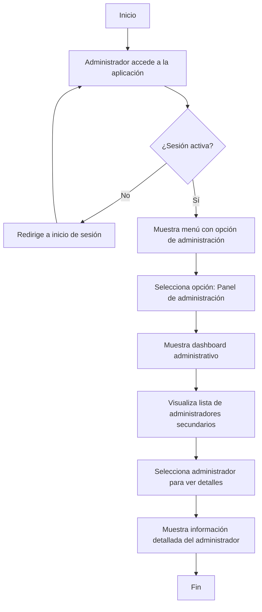
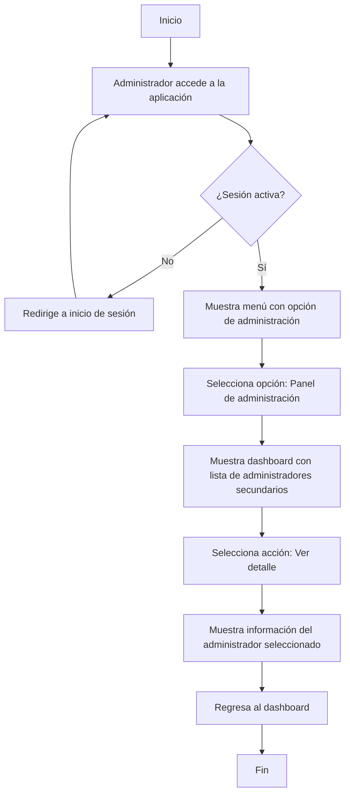
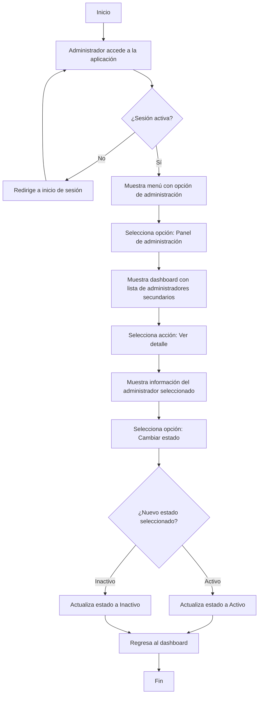

## Consultar todos los administradores

**Descripción del Flujo:**

Este flujo describe el proceso para que el administrador principal consulte a todos los administradores secundarios.

1. **Accesso al dashboard de administracion**
   - El Administrador debe inciar sesion para poder acceder al panel.
   - La opcion para acceder al panel solo se muestra en el menu si la sesion es activa
2. **Mostrar al dashboard administrativo**
   - El adminitrador accede al dashboard con una vista practiva y resumida de los administradores secundarios
   - Visualiza la lista de los administradores secundarios.
3. **Acciones disponibles**
   - En la lista de administradoers cada uno permite al administrador acceder a los detalles de la misma.

**Diagrama**

---
## Consultar el detalle del administrador secundario

**Descripción del Flujo:**

Este flujo describe el proceso para que el administrador principal consulte los detalles del perfil de los administradores secundarios.

1. **Accesso al dashboard de administracion**
   - El Administrador debe inciar sesion para poder acceder al panel.
   - La opcion para acceder al panel solo se muestra en el menu si la sesion es activa
2. **Mostrar el dashboard administrativo**
   - El adminitrador accede al panel administrativo con una vista practiva y resumida de los administradores secundarios.
   - Visualiza la lista de los administradores secundarios.
3. **Seleccionar a un administrador**
   - Al usar la accion de `detalle` se mostrara la pagina de detalle para el administrador seleccionada.
4. **Mostrar informacion**
   - Se mostrar toda la informacion relacionada con el administrador
   - Tambien se permitira cambiar el estado del administrador.
5. **Regresa al dashboard**
   - Al terminar de revisar los detalles del administrador se puede regresar al dashboard.

**Diagrama**

---

## modificar el estado del administrador

**Descripción del Flujo:**

Este flujo describe el proceso para que el administrador principal midifique el estado de los administradores secundarios.

1. **Accesso al dashboard de administracion**
   - El Administrador debe inciar sesion para poder acceder al panel.
   - La opcion para acceder al panel solo se muestra en el menu si la sesion es activa
2. **Mostrar el dashboard administrativo**
   - El adminitrador accede al panel administrativo con una vista practiva y resumida de los administradores secundarios.
   - Visualiza la lista de los administradores secundarios.
3. **Seleccionar a un administrador**
   - Al usar la accion de `detalle` se mostrara la pagina de detalle para el administrador seleccionada.
4. **Mostrar informacion**
   - Se mostrar toda la informacion relacionada con el administrador
   - Tambien se permitira cambiar el estado del administrador.
5. **Cambiar estado**
   - Al seleccionar cambiar el estado se puede poner en activo o inactivo el perfil de un administrador
      - Si se escoge Activo el perfil podra entrar a la aplicacion y realizar todas sus actividades.
      - Si se escoge Inactivo el perfil no tendra acceso a la aplicacion y no podra inciar sesion.
5. **Regresa al dashboard**
   - Al terminar de revisar los detalles del administrador se puede regresar al dashboard.

**Diagrama**
