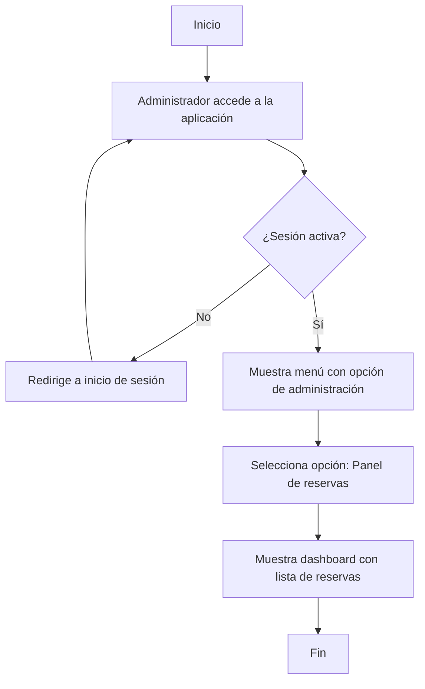
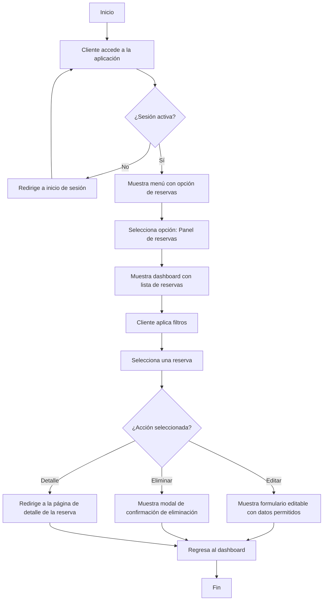
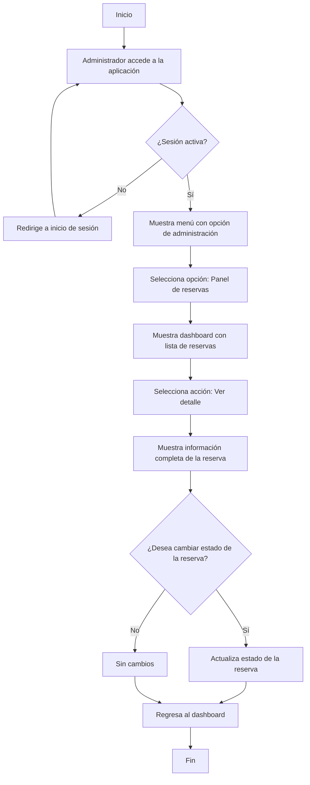
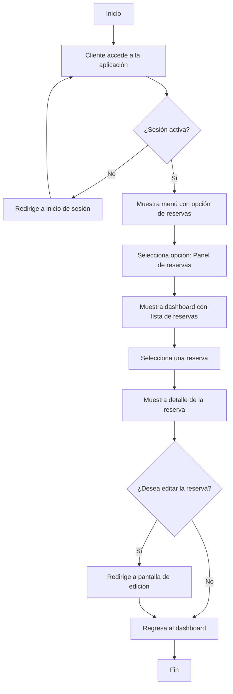
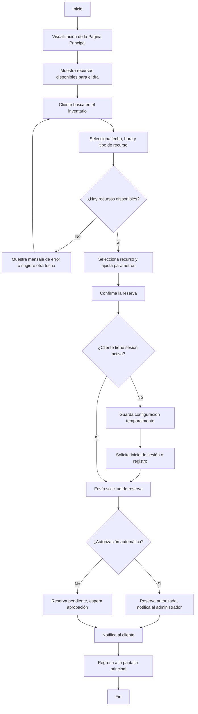
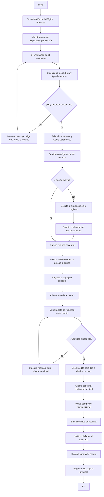
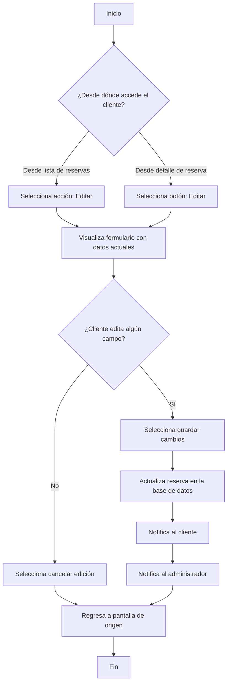
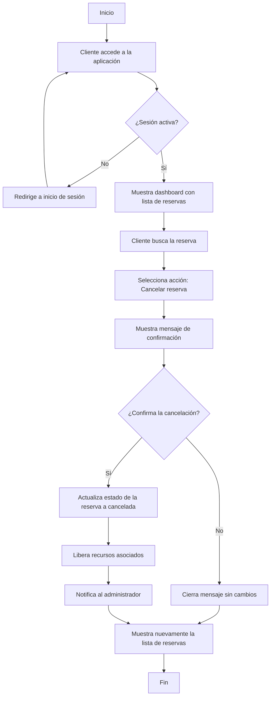
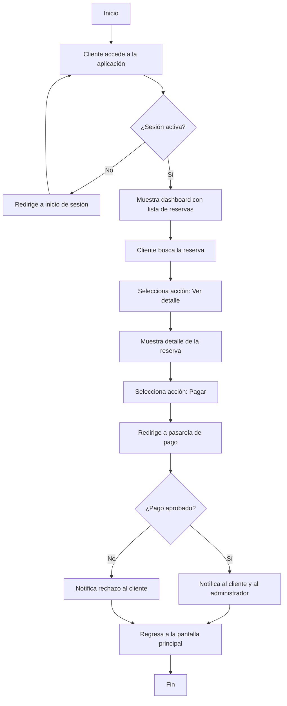
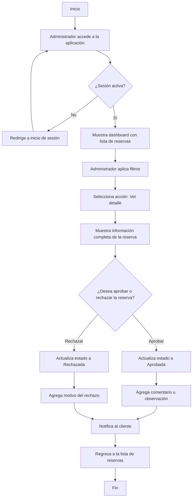

## Consulta de todas las Reservas

**Descripción del Flujo**

Este flujo describe el proceso para consultar las reservas. Existen dos rutas para realizar la consulta, la que usa el administrador utilizando su dashboard de administración y la del cliente desde su respectivo dashboard enfocado en su actividad en la aplicación.

### El Administrador Consulta las reservas
1. **Acceso al dashboard de administrador**
   - El Administrador debe iniciar sesión para poder acceder al panel.
   - La opción para acceder al panel solo se muestra en el menú si la sesión es activa
2. **Mostrar el panel administrativo**
   - El administrador accede al panel administrativo con una vista práctica y resumida de las reservas.
   - Visualiza la lista de reservas.
3. **Acciones disponibles**
   - En la lista de reservas cada una permite al administrador acceder a los detalles de la misma.

**Diagrama**

### El Cliente Consulta las reservas
1. **Acceso al dashboard de cliente**
   - El cliente debe iniciar sesión para poder acceder al panel.
   - La opción para acceder al panel solo se muestra en el menú si la sesión es activa
2. **Visualización del dashboard de cliente**
   - Inicialmente se muestran todas las reservas realizadas, iniciando por la última.
   - El usuario podrá filtrar las reservas por estado, fecha, tipo de recurso.
3. **Acciones para cada reserva**
   - Cada reserva muestra las siguientes acciones permitidas para el usuario
      - Editar: al seleccionarlo se mostrará el formulario con los datos que se permiten editar.
      - Eliminar: Al seleccionarlo, este mostrará un modal para confirmar la acción de eliminación.
      - Detalle: Se redirigirá al usuario a la página con los detalles de la reserva.

**Diagrama**

---
## Consultar el detalle de Reserva

**Descripción del Flujo**

Este flujo describe el proceso para realizar la consulta al detalle de una reserva en específico en el sistema.

### El Administrador Consulta el detalle de una reserva
1. **Acceso al dashboard de administración**
   - El Administrador debe iniciar sesión para poder acceder al panel.
   - La opción para acceder al panel solo se muestra en el menú si la sesión es activa
2. **Mostrar el dashboard administrativo**
   - El administrador accede al panel administrativo con una vista práctica y resumida de las reservas.
   - Visualiza la lista de reservas.
3. **Seleccionar una reserva**
   - Al usar la acción de `detalle` se mostrará la página de detalle para la reserva seleccionada.
4. **Mostrar información**
   - Se muestra toda la información relacionada con la reserva, incluyendo recursos, cantidad, costos, imágenes, estado, etc.
   - También se permitirá cambiar el estado de la reserva.
5. **Regresa al dashboard**
   - Al terminar de revisar los detalles de la reserva, se puede regresar a la lista de reservas.

**Diagrama**

### El Cliente Consulta el detalle de una reserva
1. **Acceso al dashboard de cliente**
   - El cliente debe iniciar sesión para poder acceder al panel.
   - La opción para acceder al panel solo se muestra en el menú si la sesión es activa
2. **Visualización del dashboard de cliente**
   - Inicialmente se muestran todas las reservas realizadas, iniciando por la última.
   - El usuario podrá filtrar las reservas por estado, fecha, tipo de recurso.
3. **Seleccionar una reserva**
   - Al usar la acción de `detalle` se mostrará la página de detalle para la reserva seleccionada.
4. **Mostrar información**
   - Se muestra toda la información relacionada con la reserva, incluyendo recursos, cantidad, costos, imágenes, estado, etc.
   - También se permitirá pasar a la pantalla de edición utilizando un botón.
5. **Regresa al dashboard**
   - Al terminar de revisar los detalles de la reserva, se puede regresar a la lista de reservas.

**Diagrama**

---

## Creación de Reservas

### Crear una reserva individual
**Descripción del Flujo**

Este flujo describe el proceso para que un cliente realice una reserva en el sistema de un único recurso.

1. **Visualización de la Página Principal**  
   - La página se muestra sin necesidad de iniciar sesión.
   - La pantalla muestra una carga inicial de todos los recursos disponibles para ese día.
   - El cliente ve la opción de buscar el recurso en el inventario disponible.

2. **Búsqueda y Consulta de Disponibilidad**  
   - El cliente selecciona la fecha (obligatorio), la hora (opcional) y el tipo de recurso (opcional).
     - Si hay recursos disponibles, continúa el flujo.
     - Si no, se muestra un mensaje que invita a elegir otra fecha o recurso.

3. **Selección del Recurso y Configuración de la Reserva**  
   - El cliente elige el recurso específico y ajusta parámetros como la cantidad o la ubicación.

4. **Confirmación de la Reserva**  
   - El cliente revisa la información y confirma los datos ingresados.
     - Si el cliente tiene sesión activa, continúa el flujo.
     - Si no tiene sesión, se le solicita que inicie sesión o se registre (se guardan los datos de la configuración de la reserva temporalmente).

5. **Envío de la Solicitud de Reserva**  
   - El sistema registra la solicitud.
     - Si el recurso tiene configuración de autorización automática, la reserva se registra con un estado de “autorizado” y se envía una notificación al administrador.
     - Si el recurso requiere autorización manual, la reserva se registra con un estado “pendiente” y se envía para aprobación.

6. **Notificación de Resultado**  
   - El cliente recibe una notificación confirmando que la reserva ha sido registrada, incluyendo los posibles estados de pendiente, aprobación o rechazo.

7. **Regresa a la pantalla principal**
   - El cliente regresa a la página principal.

### Crear una reserva desde el carrito de compras

**Descripción del Flujo:**

Este flujo describe el proceso para que un cliente realice una reserva de los recursos, incluyendo el acceso al carrito y la edición del mismo.

1. **Visualización de la Página Principal**  
   - La página se muestra sin necesidad de iniciar sesión.
   - La pantalla muestra una carga inicial de todos los recursos disponibles para ese día.
   - El cliente ve la opción de buscar el recurso en el inventario disponible.
2. **Búsqueda y Consulta de Disponibilidad**  
   - El cliente selecciona la fecha (obligatorio), la hora (opcional) y el tipo de recurso (opcional).
     - Si hay recursos disponibles, continúa el flujo.
     - Si no, se muestra un mensaje que invita a elegir otra fecha o recurso.
3. **Selección del Recurso y Configuración de la Reserva**  
   - El cliente elige el recurso específico y ajusta parámetros como la cantidad o la ubicación.
4. **Acción de Agregar a carrito**  
   - El cliente revisa la información y confirma los datos ingresados.
     - Si el cliente tiene sesión activa, continúa el flujo.
     - Si no tiene sesión, se le solicita que inicie sesión o se registre (se guardan los datos de la configuración de la reserva temporalmente).
5. **Envío a carrito** 
   - Después de configurar las especificaciones del recurso a reservar se puede agregar al carrito, para que se reserve en grupo
6. **Notificación de Resultado**  
   - El cliente recibe una notificación confirmando que la reserva ha sido agregada al carrito.
7. **Regresa a la pantalla principal**
   - El cliente regresa a la página principal.
8. **Acceso al carrito**
   - El carrito se muestra en la página de inicio, pero solo se puede acceder si la sesión está activa
9. **Mostrar Carrito** 
   - Al entrar en la página de carrito de compra se muestra la lista de recursos guardados y las cantidades (si un recurso ya no tiene la cantidad indicada en el carrito disponible se muestra un mensaje al usuario para que lo ajuste)
   - cada uno tendrá la opción para eliminar o cambiar la cantidad, así como agregar algún comentario
10. **Configuración de la Reserva**  
   - El cliente elige el recurso específico y ajusta parámetros como la cantidad o la ubicación.
11. **Validación de campos y envío de reserva**
   - Se validan los campos requeridos y la disponibilidad de los recursos al momento de enviar la solicitud de reserva
12. **Notificación de Resultado**  
   - El cliente recibe una notificación confirmando que la reserva ha sido registrada, incluyendo los posibles estados de pendiente, aprobación o rechazo.
13. **Vaciar el carrito**
   - Al crear la reserva con los recursos del carrito, este elimina todos los recursos asociados al carrito del cliente.
14. **Regresa a la pantalla principal**
   - El cliente regresa a la página principal.

**Diagrama**

---
## Editar una Reserva

**Descripción del Flujo:**

Este flujo describe el proceso para que un cliente realice una edición de la reserva en el sistema.

1. **Acceso a la página de edición**
   - Existen dos formas de acceder a la edición de una reserva
      - Seleccionando la acción en el listado de reservas.
      - Desde el detalle de la reserva.
2. **Visualización del formulario de edición**
   - Dentro de cada campo del formulario se mostrará la información guardada.
3. **Confirmar o cancelar Edición** 
   - En caso de editar algún campo del formulario se pueden guardar los cambios en la base de datos.
   - Si se cancela la edición solo se regresa a la pantalla de origen, ya sea la lista de reservas o la pantalla de detalle
4. **Notificación de Resultado**  
   - El cliente recibe una notificación confirmando que la reserva ha sido editada.
   - El administrador recibe una notificación sobre el cambio de la reserva.
5. **Regresa a la pantalla de origen**
   - El cliente regresa a la página de origen, que podría ser la lista de reservas o la pantalla de detalle.

**Diagrama**

---
## Cancelar una Reserva

**Descripción del Flujo:**

Este flujo describe el proceso para que un cliente realice una cancelación de una reserva en específico en el sistema.

1. **Visualización del dashboard de cliente**
   - Inicialmente se muestran todas las reservas realizadas, iniciando por la última.
2. **Búsqueda de la reserva**
   - El cliente busca la reserva que quiere eliminar.
   - Puede utilizar los filtros o buscarla manualmente.
3. **Cancelación de reserva**
   - En la reserva existe una acción para cancelar la reserva
4. **Mostrar mensaje de confirmación**
   - Se muestra un mensaje para que el usuario confirme si desea cancelar la reserva
      - Si confirma la cancelación esta se reflejará en la base de datos.
      - Si cancela la acción el mensaje solo se cerrará y no se guardará ningún cambio.
5. **Notificación de cambios**
   - El sistema notifica al administrador de la cancelación de la reserva.
   - También se liberarán los recursos.
6. **Ocultar mensaje**
   - Se cierra el mensaje y se muestra de nuevo la lista de reservas

**Diagrama**

---
## Pagar una Reserva

**Descripción del Flujo:**

Este flujo describe el proceso para que un cliente realice el pago de una reserva en específico en el sistema.

1. **Visualización del dashboard de cliente**
   - Inicialmente se muestran todas las reservas realizadas, iniciando por la última.
2. **Búsqueda de la reserva**
   - El cliente busca la reserva que quiere eliminar.
   - Puede utilizar los filtros o buscarla manualmente.
3. **Seleccionar una reserva**
   - Al usar la acción de `detalle` se mostrará la página de detalle para la reserva seleccionada.
4. **Seleccionar la acción de pago**
   - Dentro de la pantalla de detalle se muestra la acción de pagar.
      - Se llevará al usuario a la pasarela de pago.
5. **Notificación de Resultado**  
   - El cliente recibe una notificación confirmando que el proceso de pago ha terminado, incluyendo los posibles estados de aprobación o rechazo.
   - Se notificará el pago al administrador.
6. **Regresa a la pantalla principal**
   - El cliente regresa a la página principal.

**Diagrama**

---
## Modificar estado de la Reserva

**Descripción del Flujo:**

Este flujo describe el proceso para que un administrador realice el cambio de estado de una reserva en específico en el sistema.

1. **Visualización del dashboard de administración**
   - Inicialmente se muestran todas las reservas realizadas por todos los clientes, iniciando por la última.
   - El usuario podrá filtrar las reservas por estado, fecha, tipo de recurso.
2. **Seleccionar una reserva**
   - Al usar la acción de `detalle` se mostrará la página de detalle para la reserva seleccionada.
3. **Mostrar información**
   - Se muestra toda la información relacionada con la reserva, para que el administrador evalúe la reserva.
4. **Aprobar o rechazar reserva**
   - El administrador tiene la opción de rechazar o aprobar la reserva.
      - En caso de aprobar la reserva puede agregar un comentario u observación.
      - Si la reserva es rechazada se puede agregar el motivo del rechazo.
5. **Notificación de Resultado**  
   - El cliente recibe una notificación confirmando el estado de la reserva.
6. **Regresa a la pantalla principal**
   - El administrador regresa a la página de reservas.

**Diagrama**
