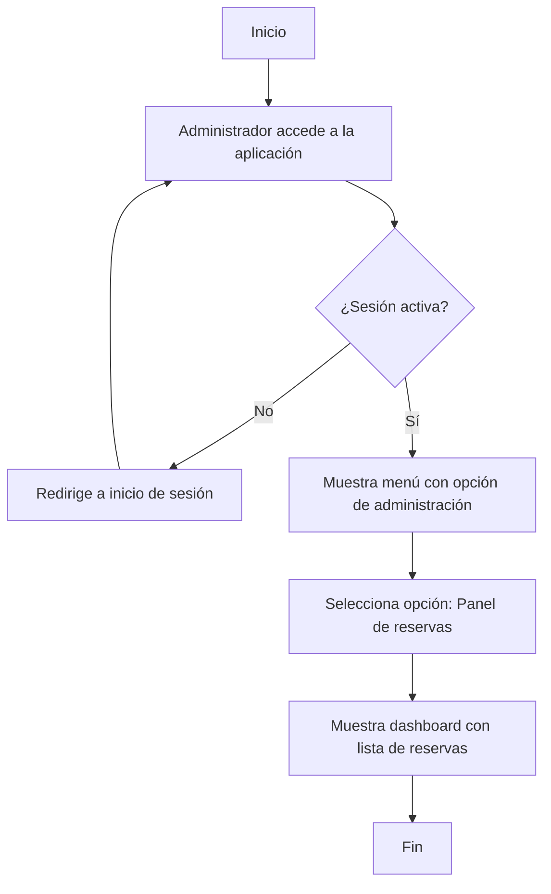
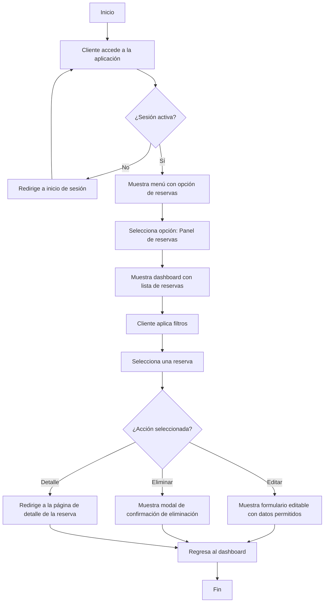
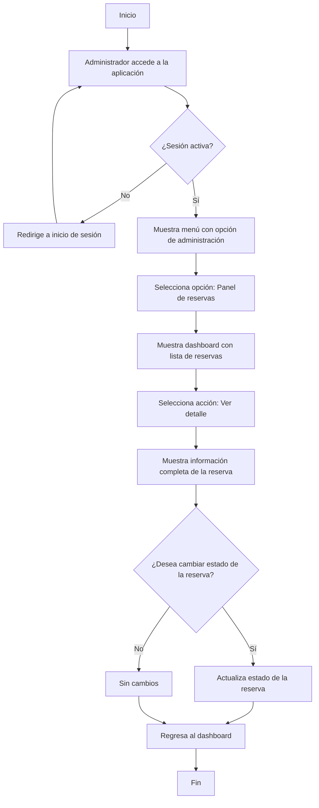
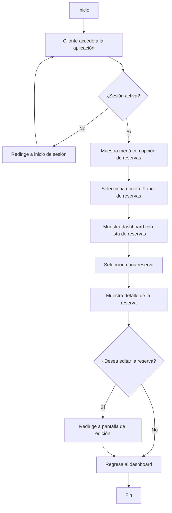
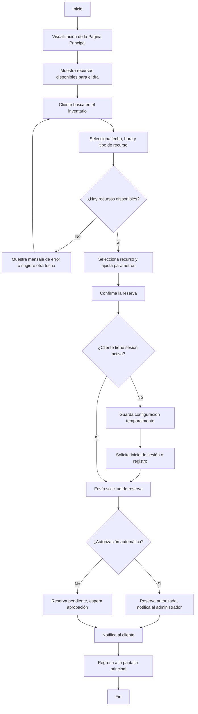
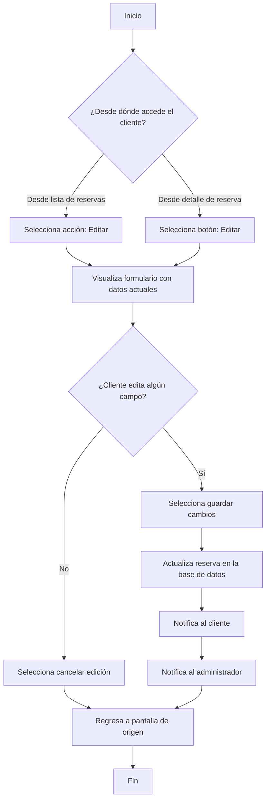
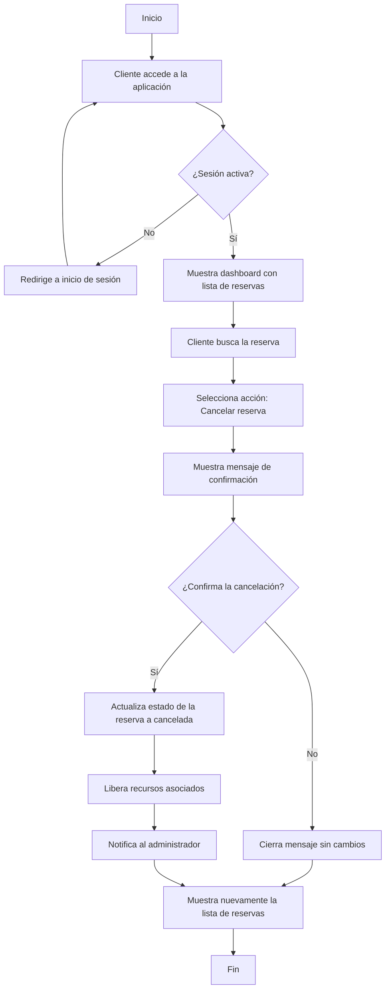
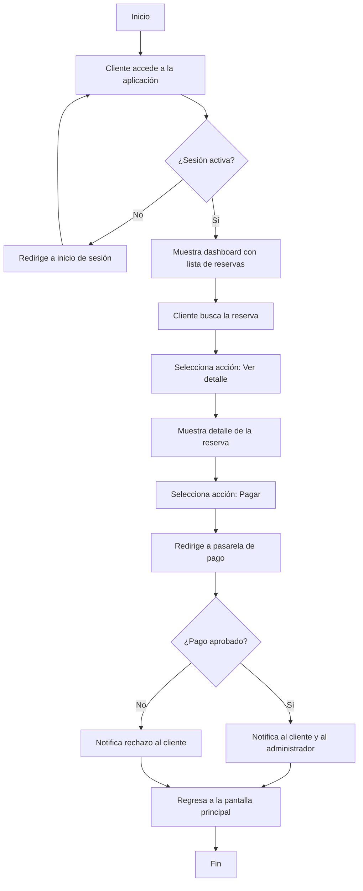
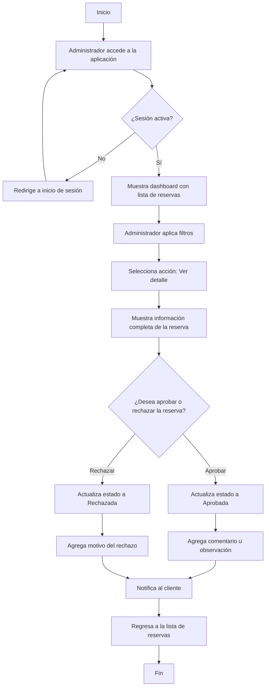

## Consulta de todas las Reservas

**Descripción del Flujo**

Este flujo describe el proceso para consultar las reservas. Existen dos rutas para realizar la consulta, la que usa el administrador utilizando su dashboard de administracicon y la del cliente desde su respectivo dashboard enfocado en su actividad en la aplicacion.

### El Administrador Consulta las reservas
1. **Accesso al dashboard de administrador**
   - El Administrador debe inciar sesion para poder acceder al panel.
   - La opcion para acceder al panel solo se muestra en el menu si la sesion es activa
2. **Mostrar el panel administrativo**
   - El adminitrador accede al panel administrativo con una vista practiva y resumida de las reservas.
   - Visualiza la lista de reservas.
3. **Acciones disponibles**
   - En la lista de reservas cada una permite al administrador acceder a los detalles de la misma.

**Diagrama**

### El Cliente Consulta las reservas
1. **Accesso al dashboard de cliente**
   - El cliente debe inciar sesion para poder acceder al panel.
   - La opcion para acceder al panel solo se muestra en el menu si la sesion es activa
2. **Visualizacion del dashboard de cliente**
   - Inicalmente se muestra todas las reservas realizadas, inicando por la ultima.
   - El usuario podra filtrar las reservas por estado, fecha, tipo de recurso.
3. **Acciones para cada reserva**
   - Cada reserva mostrar las siguientes acciones permitidas para el usuario
      - Editar: al seleccionarlo se mostrara el formulario con los datos que se permiten editar.
      - Eliminar: Al seleccionarlo, este mostrara un modal para confirmar la accion de eliminacion.
      - Detalle: Se redirigira al usuario a la pangina con los detalles de la reseva.

**Diagrama**

---
## Cosultar el detalle de Reserva

**Descripción del Flujo**

Este flujo describe el proceso para realizar la consulta al detalle de una reserva en especifico en el sistema.

### El Administrador Consulta el detalle de una reserva
1. **Accesso al dashboard de administracion**
   - El Administrador debe inciar sesion para poder acceder al panel.
   - La opcion para acceder al panel solo se muestra en el menu si la sesion es activa
2. **Mostrar al dashboard administrativo**
   - El adminitrador accede al panel administrativo con una vista practiva y resumida de las reservas.
   - Visualiza la lista de reservas.
3. **Seleccionar una reserva**
   - Al usar la accion de `detalle` se mostrara la pagina de detalle para la reserva seleccionada.
4. **Mostrar informacion**
   - Se mostrar toda la informacion relacionada con la reserva, incluyendo recursos, catidad, costos, imagenes, estado, etc.
   - Tambien se permitira cambiar el estado de la reserva.
5. **Regresa al dashboard**
   - Al terminar de revisar los detalles de la reserva, se puede regresar a la lista de reservas.

**Diagrama**

### El Cliente Consulta el detalle de una reserva
1. **Accesso al dashboard de cliente**
   - El cliente debe inciar sesion para poder acceder al panel.
   - La opcion para acceder al panel solo se muestra en el menu si la sesion es activa
2. **Visualizacion del dashboard de cliente**
   - Inicalmente se muestra todas las reservas realizadas, inicando por la ultima.
   - El usuario podra filtrar las reservas por estado, fecha, tipo de recurso.
3. **Seleccionar una reserva**
   - Al usar la accion de `detalle` se mostrara la pagina de detalle para la reserva seleccionada.
4. **Mostrar informacion**
   - Se mostrar toda la informacion relacionada con la reserva, incluyendo recursos, catidad, costos, imagenes, estado, etc.
   - Tambien se permitira pasar a la pantalla de edicion utilizando un boton.
5. **Regresa al dashboard**
   - Al terminar de revisar los detalles de la reserva, se puede regresar a la lista de reservas.

**Diagrama**

---

## Creacion de Reservas

### Reservar un unico recrurso
**Descripción del Flujo**

Este flujo describe el proceso para que un cliente realice una reserva en el sistema de un unico recurso.

1. **Visualización de la Página Principal**  
   - La página se muestra sin necesidad de iniciar sesión.
   - La pantalla muestra una carga incial de todos los recursos disponibles para ese dia.
   - El cliente ve la opción de buscar el recurso en el inventario disponible.

2. **Búsqueda y Consulta de Disponibilidad**  
   - El cliente selecciona la fecha (obligatorio), la hora (opcional) y el tipo de recurso (opcional).
     - Si hay recursos disponibles, continúa el flujo.
     - Si no, se muestra un mensaje que invita a elegir otra fecha o recurso.

3. **Selección del Recurso y Configuración de la Reserva**  
   - El cliente elige el recurso específico y ajusta parámetros como la cantidad o la ubicación.

4. **Confirmación de la Reserva**  
   - El cliente revisa la información y confirma los datos ingresados.
     - Si el cliente tiene sesión activa, continúa el flujo.
     - Si no tiene sesión, se le solicita quen iicie sesión o se registre (se guardan los datos de la configuracion de la reserva temporalmente).

5. **Envío de la Solicitud de Reserva**  
   - El sistema registra la solicitud.
     - Si el recurso tiene configuración de autorización automática, la reserva se registra con un estado de “autorizado” y se envía una notificación al administrador.
     - Si el recurso requiere autorización manual, la reserva se registra con un estado “pendiente” y se envía para aprobación.

6. **Notificación de Resultado**  
   - El cliente recibe una notificación confirmando que la reserva ha sido registrada, incluyendo los posibles estados de pendiente, aprobación o rechazo.

7. **Regresa a la pantalla principal**
   - El cliente regresa a la pagina principal.

### Reservar un grupo de recrursos
**Descripción del Flujo**

Este flujo describe el proceso para que un cliente realice una reserva en el sistema de un grupo recursos.

---
## Editar una Reserva

**Descripción del Flujo:**

Este flujo describe el proceso para que un cliente realice una edicion de la reserva en el sistema.

1. **Acceso a la pangina de edicion**
   - Existe dos forma de acceder a la edicion de una reserva
      - Seleccionando la accion en el listado de reservas.
      - Desde el detalle de la reserva.
2. **Visualizacion del formulario de edicion**
   - Dentro de cada campo del formulario se mostrara la informacion guardada.
3. **Confirmar o cancelar Edicion** 
   - En caso de editar algun campo del formaulario se puede guardar los cambio en la base de datos.
   - Si se cancela la edicion solo se regresa a la pantalla de origen, ya sea la lista de reservas o la pantalla de detalle
4. **Notificación de Resultado**  
   - El cliente recibe una notificación confirmando que la reserva ha sido editada.
   - El administrador recibe una notificacion sobre el cambio de la reserva.
5. **Regresa a la pantalla de origen**
   - El cliente regresa a la pagina de origen, que podria se la lista de reservas o la pantalla de detalle.

**Diagrama**

---
## Cancelar una Reserva

**Descripción del Flujo:**

Este flujo describe el proceso para que un cliente realice una cancelacion de una reserva en especifico en el sistema.

1. **Visualizacion del dashboard de cliente**
   - Inicalmente se muestra todas las reservas realizadas, inicando por la ultima.
2. **Busqueda de la reserva**
   - El cliente buscala reserva que quiere eliminar.
   - Puede utilizar los filtro o buscarla manualmente.
3. **Cancelacion de reserva**
   - En la reserva excite una accion para cancelar la reserva
4. **Mostrar mensaje de confirmacion**
   - Se mostrar un mensaje para que el usuario confirme si desea cancelar la reserva
      - Si confirma la cancelacion esta se reflejara en la base de datos.
      - Si cancela la accion el mensaje solo se cerrara y no se guardara ningun cambio.
5. **Notificacion de cambios**
   - El sistema notifica al administrador de la cancelacion de la reserva.
   - Tambien se liberaran los recursos.
6. **Ocultar mensaje**
   - Se cerrar el mensaje y se mostrar de nuevo la lista de reservas

**Diagrama**

---
## Pagar una Reserva

**Descripción del Flujo:**

Este flujo describe el proceso para que un cliente realice el pago de una reserva en especifico en el sistema.

1. **Visualizacion del dashboard de cliente**
   - Inicalmente se muestra todas las reservas realizadas, inicando por la ultima.
2. **Busqueda de la reserva**
   - El cliente buscala reserva que quiere eliminar.
   - Puede utilizar los filtro o buscarla manualmente.
3. **Seleccionar una reserva**
   - Al usar la accion de `detalle` se mostrara la pagina de detalle para la reserva seleccionada.
4. **Seleccionar la accion de pago**
   - Dentro de la pantalla de detalle se muestra la accion de pagar.
      - Se llevara al usuario a la pasarela de pago.
5. **Notificación de Resultado**  
   - El cliente recibe una notificación confirmando que proceso de pago ha terminado, incluyendo los posibles estados de aprobación o rechazo.
   - Se notificara el pago al administrador.
6. **Regresa a la pantalla principal**
   - El cliente regresa a la pagina principal.

**Diagrama**

---
## Modificar estado de la Reserva

**Descripción del Flujo:**

Este flujo describe el proceso para que un administrador realice el cambio de estado de una reserva en especifico en el sistema.

1. **Visualizacion del dashboard de administracion**
   - inicalmente se muestra todas las reservas realizadas por todos los clientes, inicando por la ultima.
   - El usuario podra filtrar las reservas por estado, fecha, tipo de recurso.
2. **Seleccionar una reserva**
   - Al usar la accion de `detalle` se mostrara la pagina de detalle para la reserva seleccionada.
3. **Mostrar informacion**
   - Se mostrar toda la informacion relacionada con la reserva, para que el administrador evalue la reserva.
4. **Aprobar o rechazar reserva**
   - El administrador tiene la opcion de rechazar o aprobar la reserva.
      - En caso de aprorbar la reserva puede agregar un comentario o observacion.
      - Si la reserva es rechazada se puede agregar el motivo del rechazo.
5. **Notificación de Resultado**  
   - El cliente recibe una notificación confirmando el estado de la reserva.
6. **Regresa a la pantalla principal**
   - El administrador regresa a la pagina de reservas.

**Diagrama**
