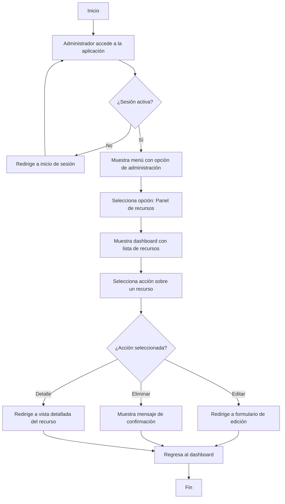
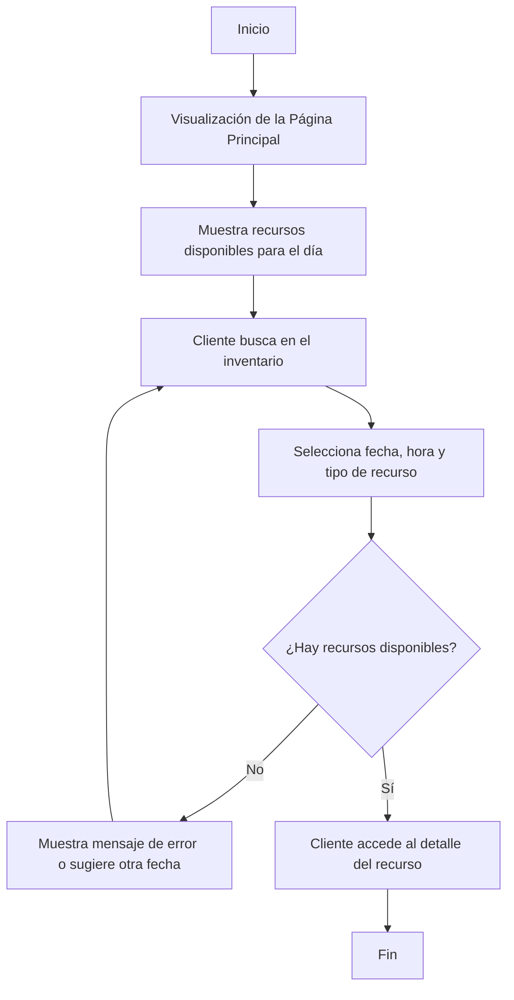
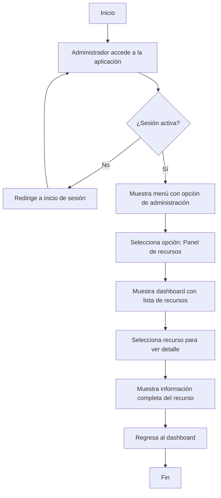
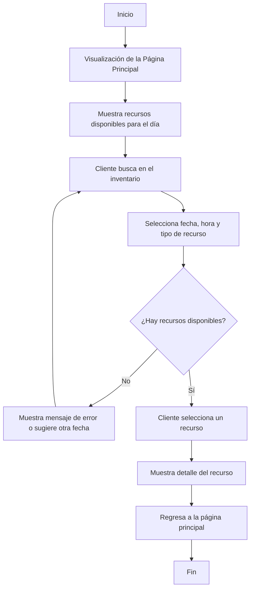
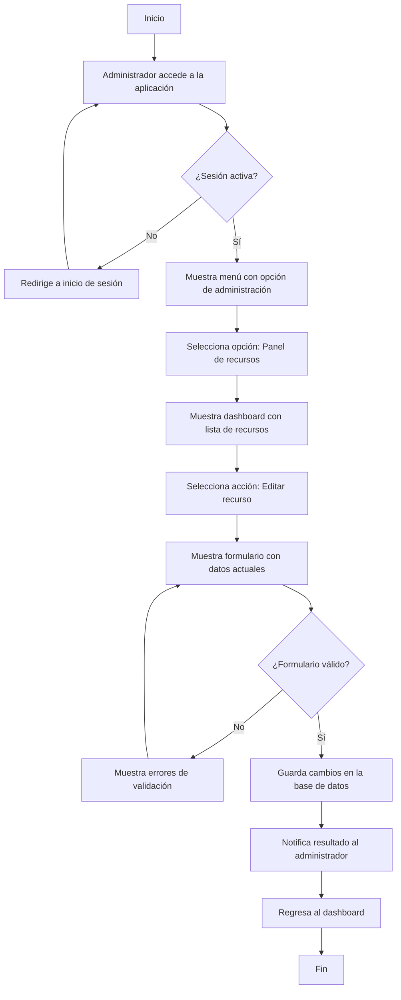
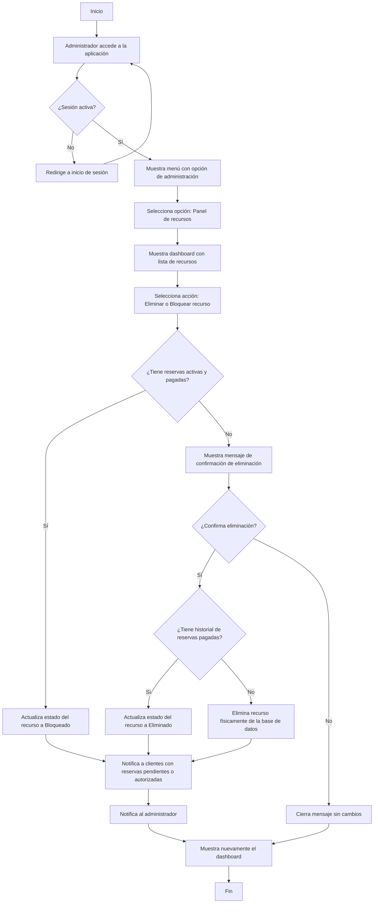

## Consulta de Recursos

**Descripción del Flujo:**

Este flujo describe el proceso para consultar los recursos.
Existen dos formas de ver los recursos, la del administrador desde un panel administrativo y la del cliente que es la vista demostrativa.

### El Administrador Consulta los Recursos
1. **Accesso al dashboard de administracion**
   - El Administrador debe inciar sesion para poder acceder al panel.
   - La opcion para acceder al panel solo se muestra en el menu si la sesion es activa
2. **Mostrar al dashboard administrativo**
   - El adminitrador accede al panel administrativo con una vista practiva y resumida de los recursos
   - Visualiza la lista de recursos.
3. **Acciones disponibles**
   - En la lista de recursos cada una muestra las siguientes acciones disponibles
      - Editar recurso mostrando la pagina de edicion.
      - Eliminar recurso mostrando un mesaje de confirmacion.
      - Detalle del recurso.

**Diagrama**

### El Cliente Consulta los Recursos
1. **Visualización de la Página Principal**  
   - La página se muestra sin necesidad de iniciar sesión.
   - La pantalla muestra una carga incial de todos los recursos disponibles para ese dia.
   - El cliente ve la opción de buscar el recurso en el inventario disponible.
2. **Búsqueda y Consulta de Disponibilidad**  
   - El cliente selecciona la fecha (obligatorio), la hora (opcional) y el tipo de recurso (opcional).
     - Si hay recursos disponibles, continúa el flujo.
     - Si no, se muestra un mensaje que invita a elegir otra fecha o recurso.
3. **Selección de Recurso**  
   - El cliente puede acceder a los detalles de un recurso.

**Diagrama**

---

## Consulta del detalle de un recurso

**Descripción del Flujo:**

Este flujo describe el proceso para consultar el detalle del recurso.
Existen dos formas de ver el detalle del recurso, la del administrador desde un panel administrativo y la del cliente que es la vista demostrativa.

### El Administrador Consulta el detalle de un recurso.

1. **Accesso al dashboard de administracion**
   - El Administrador debe inciar sesion para poder acceder al panel.
   - La opcion para acceder al panel solo se muestra en el menu si la sesion es activa
2. **Mostrar al dashboard administrativo**
   - El adminitrador accede al panel administrativo con una vista practiva y resumida de los recursos
   - Visualiza la lista de recursos.
3. **Selección de Recurso**  
   - El administrador puede acceder a los detalles de un recurso al seleccionar uno desde el dashboard.
4. **Visualizacion del detalle**
   - Se muestra la pagina con todos los detalles relevantes para el administrador relacionados con este recurso.
5. **Regresar al dashboard**
   - Al terminar de revisar el recurso el administrador puede regresar al dashboard y seguir consultando otros recursos.

**Diagrama**

### El Cliente Consulta el detalle del Recurso
1. **Visualización de la Página Principal**  
   - La página se muestra sin necesidad de iniciar sesión.
   - La pantalla muestra una carga incial de todos los recursos disponibles para ese dia.
   - El cliente ve la opción de buscar el recurso en el inventario disponible.
2. **Búsqueda y Consulta de Disponibilidad**  
   - El cliente selecciona la fecha (obligatorio), la hora (opcional) y el tipo de recurso (opcional).
     - Si hay recursos disponibles, continúa el flujo.
     - Si no, se muestra un mensaje que invita a elegir otra fecha o recurso.
3. **Selección de Recurso**  
   - El cliente puede acceder a los detalles de un recurso al seleccionar uno desde la pangina principal.
4. **Visualizacion del detalle**
   - Se muestra la pagina con todos los detalles relevantes para el cliente relacionados con este recurso.
5. **Regresar a la pagina principal**
   - Al terminar de revisar el recurso el cliente puede regresar a la pagina principal para seguir buscando.

**Diagrama**

---

## Crear un Recurso

**Descripción del Flujo:**

Este flujo describe el proceso para que un administrador cree un recurso en el sistema. 

1. **Accesso al dashboard de administracion**
   - El Administrador debe inciar sesion para poder acceder al panel.
   - La opcion para acceder al panel solo se muestra en el menu si la sesion es activa.
2. **Mostrar al dashboard administrativo**
   - El adminitrador accede al panel administrativo con una vista practiva y resumida de los recursos
   - Visualiza la lista de recursos.
3. **Crear un recurso**
   - En la parte superior de la lista se encuentra la accion para crear un nuevo recuros
   - Al seleccionarla el se llevara al usuario a la pagina de creacion.
4. **Mostrar Formulario**
   - Al ingresar a la pangina de creacion de recursos se mostrara el formulario de los datos requeridos
   - Se validaran los campos obligatorios antes de guardar los datos
   - Si pasa las validaciones se guarda la informacion
5. **Notificación de Resultado:**  
   - El usuario recibe una notificación confirmando que el recurso ha sido registrada, o si ocurrio algun error.
6. **Regreso al panel principal**
   - Al finalizar la accion de creacion se regresa al dashboard

**Diagrama**

---

## Editar un Recurso

**Descripción del Flujo:**

Este flujo describe el proceso para que se edite un recurso en el sistema.

1. **Accesso al panel de administracio**
   - El Administrador debe inciar sesion para poder acceder al panel.
   - La opcion para acceder al panel solo se muestra en el menu si la sesion es activa.
2. **Mostrar el panel administrativo**
   - El adminitrador accede al panel administrativo con una vista practiva y resumida de los recursos
   - Visualiza la lista de recursos.
3. **Editar un recurso**
   - En la lista se encuentra la accion para editar un recuro
   - Al seleccionarla el se llevara al usuario a la pagina de edicion.
4. **Mostrar Formulario**
   - Al ingresar a la pangina de edicion de recursos se mostrara el formulario con los datos en sus respectivos
   - Se validaran los campos obligatorios antes de guardar los datos
   - Si pasa las validaciones se guarda la informacion
5. **Notificación de Resultado:**  
   - El usuario recibe una notificación confirmando que el recurso ha sido actualizado, o si ocurrio algun error.
6. **Regreso al panel principal**
   - Al finalizar la accion de creacion se regresa al dashboard

**Diagrama**

---

## Eliminar un Recurso

**Descripción del Flujo:**

Este flujo describe el proceso para que elimine un recurso en el sistema.
1. **Accesso al panel de administracio**
   - El Administrador debe inciar sesion para poder acceder al panel.
   - La opcion para acceder al panel solo se muestra en el menu si la sesion es activa.
2. **Mostrar el panel administrativo**
   - El adminitrador accede al panel administrativo con una vista practiva y resumida de los recursos
   - Visualiza la lista de recursos.
3. **Eliminar un recurso**
   - En la lista se encuentra la accion para eliminar  o  bloquear un recuro
   - La accion de bloqueo siempre esta presente.
   - La accion de eliminacion solo se muestra si ese recurso no tiene ninguna reserva activa y pagada asociada.
4. **Mostrar mensaje de confirmacion**
   - Se mostrar un mensaje para confirmar la accion en dos esenarios posibles.
      - Si el recurso tiene almenos una reserva activa y pagada, se bloqueara el recurso para que nadie mas pueda reservarlo.
      - Si no tiene ninguna reserva asociada se pedira confirmar la accion de eliminacion y se actualizara la base de datos
   - En caso de cancelar la accion el mensaje solo se cerrara y no se guardara ningun cambio.
5. **Proceso de eliminacion**
   - Existe dos formas dependiendo el historial de reservas del recurso
      - Si se reservo y pago almenos una vez, el estatus del recurso se cambia a eliminada.
      - Si nunca se reservo y pago almenos una vez, se eliminara fisicamente de la base de datos.
5. **Notificacion de cambios**
   - El sistema notifica de la cancelacion de la reserva a todos los clientes donde los estatus fueran pendiente o autorizada .
   - Tambien se mostrara un mesaje de confimacion de accion al administrador.
6. **Ocultar mensaje**
   - Se cerrar el mensaje y se mostrar de nuevo el dashboard.

**Diagrama**
